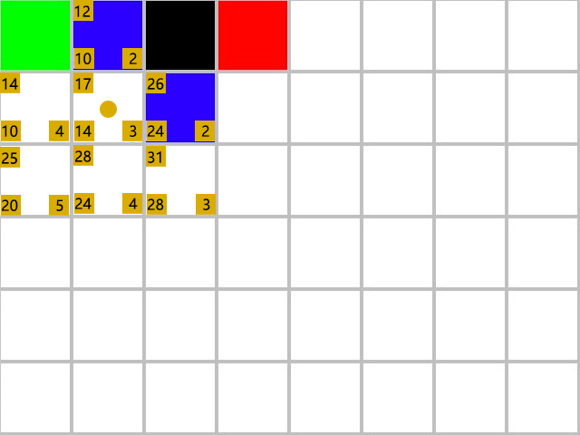

# A星巡路


## 目录

1. #### **前言**

2. #### 常见巡路实现思路

4. #### **坐标距离衡量**

5. #### **地图网格化**

6. #### 估价函数

7. #### 巡路步骤

10. #### 巡路优化

11. #### 总结


## **1. 前言**

​	A星（A-Star）算法是一种经典的**最短路径路径搜索算法**，广泛应用于**游戏开发**、机器人导航、地理信息GIS系统等领域，在游戏开发中常用于**物体路径巡路**，简单来说在地图在A点和B点间如何避开障碍物寻找一条最短路径。

## 2.常见巡路实现思路

- #### 深度优先搜索（DFS）

  - **算法思路**‌：从起始节点开始，沿着一条路径尽可能深地访问节点，直到无法继续，然后回溯并尝试其他路径。
  - ‌**特点**‌：适用于找到一条路径，**但不保证是最短路径**，适用于**小规模**的巡路地图。
  - ‌**实现步骤**‌：将起始节点压入栈中，弹出栈顶节点，如果是目标节点则结束搜索，回溯路径，否则将未访问的邻居节点压入栈中。
  - ‌**适用场景**‌：需要找到任意一条路径的情况‌；计算无向图的连通区域数量；树/图的遍历，连通性检测

- #### 广度优先搜索（BFS）

  - **算法思路**‌：从起始节点开始，**逐层向外扩展**，同一层所有节点遍历完毕后才会处理下一层节点。

  - ‌**特点**‌：**保证找到的路径是最短路径**，但需要**遍历存储较多的节点**。

  - ‌**实现步骤**‌：将起始节点加入队列，出队一个节点，如果是目标节点则结束搜索，否则将未访问的邻居节点入队。每个节点首次被访问时即记录其最短路径（最短路径回溯关键）

  - ‌**适用场景**‌：地图遍历寻找最短路径，迷宫问题‌

  - 2个示例，绿色为起点，红色为终点，黑色为障碍物，蓝色为巡路路径

    示例1

    

    示例2

    

- #### Dijkstra(迪杰斯特拉)算法

  - **算法思路**‌：使用了**广度优先搜索算法**思路，用于求解带权有向、无向图等中的单源最短路径问题，维护一个优先队列，每次选择当前距离起点最近的未访问节点，并逐步更新与其邻接的节点的最短路径。
  - ‌**特点**‌：可以处理边的权重为正的图，找到起始节点到其他所有节点的最短路径，但**时间复杂度较高**。
  - ‌**实现步骤**‌：初始化起始节点距离为0，其他节点距离为无穷大，每次取出距离最小的节点并更新邻居节点的距离。
  - ‌**适用场景**‌：有向图或无向图中，边的权重为正，需要找到单源最短路径的情况‌
  
- #### A星算法

  - **算法思路**‌：一种启发式搜索算法，结合了Dijkstra算法的思想和启发式函数h(n)，通过评估函数f(n) = g(n) + h(n)来选择下一个扩展的节点。
  - ‌**特点**‌：能够找到最短路径，且效率较高，适用于需要快速找到最短路径的情况。
  - ‌**实现步骤**‌：维护一个优先队列，每次选择评估函数值最小的节点进行扩展。
  - ‌**适用场景**‌：通常巡路路径有一定复杂度（障碍物阻挡），需要找到最短路径的情况‌

## 3. 坐标距离衡量

​	在A星算法中，网格路径常用**曼哈顿距离**和**欧几里得距离**作为网格距离衡量算法

### **曼哈顿距离**

​	曼哈顿距离（Manhattan Distance）是一种在几何度量空间中**计算两点距离**的方法，定义为**两点在标准坐标系上各坐标轴方向上的绝对轴距总和**，是指在一个坐标系中，从一个点到另一个点沿着网格线（水平或垂直）的距离。曼哈顿距离**只允许朝上下左右四个方向移动**。示意图如下：


网格中有蓝、橙、红三条路径，三条路径计算出来的**总路径长度**都是相等的，可以用如下公式表示曼哈顿距离D

```javascript
D = |x1 - x2| + |y1 - y2|
```

### **欧几里得距离**

​	欧几里得距离，是指在n维空间中，**两点之间的直线距离**。它是由古希腊数学家欧几里得所提出的。在二维空间中，欧几里得距离可以通过**勾股定理**得到，即两点之间的距离等于它们在 x 轴上的距离的平方加上它们在 y 轴上的距离的平方，再取平方根。下图为一个二维空间中 `A` 点到 `B` 点的欧几里得距离示意图：


A点到B点距离计算公式为：


## 4. 地图网格化

将要巡路的地图平均划分为多个等比正方形，根据巡路实际需求将网格标记为**可行走区域**和**不可行走区域**


图中白色网格代表可行走区域，黑色网格代表不可行走区域，约定八向移动（正向、竖向、斜45度）时遇到障碍物不能横跨障碍物

## 5. 估价函数

那A星寻路是根据什么规则寻找最短路径呢？

- **F = G + H**
  - **F**‌：当前节点总估价，节点优先级评估值
  
  - **G**‌：从起点到当前节点的实际移动代价
  
  - ‌**H**‌：当前节点到终点的**预估代价**，常用方法包括：
  
    - ‌**曼哈顿距离**‌：适用于允许上下左右移动的场景
    - ‌**欧几里得距离**‌：适用于允许斜向移动的场景
  
- **G值移动成本‌**
  - G值记录从起点到当前节点的实际移动成本‌，采用累加计算方式
  
  - 反映已探索路径的真实长度
  
  - 确保路径选择的客观性（避免偏离起点过远）
  
- ‌**H值的启发引导作用**‌

  - H值表示当前节点到终点的‌**预估移动成本**‌，采用曼哈顿距离、欧几里得距离等启发式计算方法。

  - 提供方向性引导（优先靠近目标的节点）
  - 加速路径收敛（减少无效方向探索）

- ‌**F值的综合决策价值**‌

  - F=G+H的公式实现‌**历史成本与未来预期的平衡**‌：

  - G值防止过度依赖预估（避免陷入局部最优）

  - H值避免完全盲目搜索（提升算法效率）

## 6. 开始巡路

#### **1. 巡路数据结构**

​	开放列表（Open List）‌：存储待评估节点（优先队列按 `f` 值排序）

‌	关闭列表（Closed List）‌：存储已评估节点（遍历相邻节点时跳过）

#### ‌**2. 算法步骤**

1. ‌把起点加入开放列表

2. 循环处理开放列表

3. **取出**（poll）开放列表中 `f` 值最小的节点作为**当前节点**

4. 若当前节点为终点，回溯生成寻路路径，结束路径查找

5. 把当前节点加入到关闭列表

6. 生成多个相邻节点（8 方向或 4 方向扩展），遍历相邻节点

7. 若相邻节点不可通过或存在于关闭列表，跳过

8. 计算相邻节点移动成本g值(水平/垂直移动成本为 10，斜向移动为 14)，**加上当前节点g值**作为实际移动代价

9. 若相邻节点实际移动代价更低，更新相邻节点的`父节点、f、 g、h `值，将节点**加入**(add)开放列表，

   **重复步骤2**

**关键代码示例：**

```java
private List<Node> findPath(Node start, Node end, Node[][] grid) {
        // 开放列表(优先队列)
        PriorityQueue<Node> openList = new PriorityQueue<>(Comparator.comparingInt(n -> n.f));
        // 关闭列表
        Set<Node> closedList = new HashSet<>();

        start.g = 0;
        start.calcH(end);
        start.f = start.g + start.h;
        openList.add(start);

        while (!openList.isEmpty()) {
            Node current = openList.poll();
            if (Objects.equals(current, end)) {
                return backtrackPath(current);
            }
            closedList.add(current);
            List<Node> neighbors = getNeighbors(current, grid);
            for (Node neighbor : neighbors) {
                if (neighbor.isObstacle || closedList.contains(neighbor)) {
                    continue;
                }
                int tempG = current.g + getCost(current, neighbor);
                if (tempG < neighbor.g) {
                    neighbor.parent = current;
                    neighbor.g = tempG;
                    neighbor.calcH(end);
                    neighbor.f = neighbor.g + neighbor.h;

                    if (!openList.contains(neighbor)) {
                        openList.add(neighbor);
                    }
                }
            }
        }
        return null;
    }
```

#### ‌**3. 巡路示例**

3.1 绿色为起点，红色为重点红点，黑色为障碍物，蓝色为巡路生成的最短路径


3.2 黄色圆圈为当前节点，相邻节点分别为（1,0）节点、（1,1）节点、（0,1）节点，遍历完所有相邻节点，得出各相邻节点f、g、h值，左上角黄色标签为f值，左下角标签为g值，右下角为h值


3.3 继续循环，这时坐标为（1,0）节点F值值最小，**当前节点**被更新为（0,1）节点，由于(0,0)节点在关闭列表中，所以可遍历的相邻节点分别为（1,1）节点、（2,1）节点，继续遍历完所有相邻节点，更新各相邻节点f、g、h值，


3.4 继续循环，这时坐标为（1,0）节点F值值最小，**当前节点**被更新为（1,0）节点...更新各相邻节点f、g、h值


3.5 继续循环，这时坐标为（1,1）节点F值值最小，**当前节点**被更新为（1,1）节点...更新各相邻节点f、g、h值



3.6 继续循环，这时坐标为（0,2）节点F值值最小，**当前节点**被更新为（0,2）节点...更新各相邻节点f、g、h值


3.7 继续循环，这时坐标为（2,1）节点F值值最小，**当前节点**被更新为（2,1）节点...更新各相邻节点f、g、h值


3.8 继续循环，这时坐标为（1,2）节点F值值最小，**当前节点**被更新为（1,2）节点...更新各相邻节点f、g、h值


3.9 继续循环，这时坐标为（2,2）节点F值值最小，**当前节点**被更新为（2,2）节点...更新各相邻节点f、g、h值


3.10 继续循环，这时坐标为（4,1）节点F值值最小，**当前节点**被更新为（4,1）节点...更新各相邻节点f、g、h值


3.11 继续循环，这时坐标为（0,3）节点F值值最小，**当前节点**被更新为（0,3）节点...更新各相邻节点f、g、h值


3.12 继续循环，这时坐标为（3,0）节点F值值最小，**当前节点**被更新为（3,0）节点，当前节点是终点，结束寻路路径查找，路径回溯时根据**父节点**生成最短路径

## 7. 寻路优化

#### 1.h值计算方式

可以使用曼哈顿距离欧几里得距离，减少不必要的浮点运算，提升堆操作效率。

#### 2.开放列表优化

可使用**二叉堆**维护开放列表，在Java中可使用Java原生自带<span title="优先队列是一种特殊的队列，它的元素有优先级属性，按照优先级出队，元素的优先级越高，越先出队">***优先队列***</span> `PriorityQueue`来快速获取最小 f 值节点，主要原因如下：

##### **2.1. 核心需求：快速获取最小 f 值节点**‌

A星算法的核心操作是反复从**开放列表**中取出 f 值最小的节点‌。这一操作需要满足频繁的插入节点、提取最小值节点高效

##### **2.2 二叉堆操作复杂度**‌

| ‌**操作**‌             | <span style="display:inline-block;width:100px">时间复杂度</span>‌ | ‌**说明**‌                                                     |
| -------------------- | ------------------------------------------------------------ | ------------------------------------------------------------ |
| 插入节点（`add`）    | O(log⁡n)                                                      | 堆的插入操作通过**上浮**（bubble up）保证有序性              |
| 提取最小值（`poll`） | O(log⁡n)                                                      | 删除堆顶后，通过**下沉**（bubble down）维护堆结构            |
| 更新节点优先级       | O(n)                                                         | 需先删除旧值再插入新值（PriorityQueue未直接支持，需结合逻辑处理） |

插入、提取最小值O(log⁡n)复杂度：设堆元素数量为n，树高h =log₂n，操作次数上限为h次比较交换

#### 二叉堆

- 二叉堆本质上是一种<span title="若二叉树的深度为 h，除第 h 层外，其它各层的结点数都达到最大个数，第 h 层所有的叶子结点都连续集中在最左边，这就是完全二叉树">***完全二叉树***</span>，它分为两类：**最大堆和最小堆**。最大堆的任何一个父节点的值都大于或等于它左右孩子节点的值；最小堆的任何一个父节点的值，都小于或等一它左右孩子节点的值
- 最大堆的堆顶是整个堆中的最大元素；最小堆的堆顶是整个堆中的最小元素
- 堆元素用数组来存储，而不是链表


如下图中的数组来表示上图中的完全二叉树


i为数组下标，数组元素可以从0开始或1开始

|          | 根节点从0开始 | 根节点从1开始 |
| -------- | ------------- | ------------- |
| 左子节点 | 2i+1          | 2i            |
| 右子节点 | 2i+2          | 2i+1          |
| 父节点   | (i−1)/2       | i/2           |

查找父节点不需要指针联合，加快了父节点的查找

##### 插入节点

插入位置是完全二叉树的最后一个位置。例如插入一个新节点，值是0


新节点的父节点5比0大，不符合堆的性质。于是让新节点上浮，和父节点交换位置。


 继续用节点0和父节点3做比较，因为0小于3，则让新节点继续“上浮”。


 继续比较，最终新节点0“上浮”到了堆顶位置。


##### 弹出堆顶元素

弹出堆顶元素过程和插入节点的过程正好相反，弹出堆顶元素1。

 


为了继续维持完全二叉树的结构，堆的最后一个节点10临时补到原本堆顶的位置。


让暂处堆顶位置的节点10和它的左、右 孩子进行比较，如果左、右孩子节点中最小的一个 （显然是节点2）比节点10小，那么让节点10“下沉”。


继续让节点10和它的左、右孩子做比较，左、右 孩子中最小的是节点7，由于10大于7，让节点10继续 “下沉”。


## 8. 总结

A星算法的核心公式为：`F = G + H`。A星算法利用这个公式的值来计算最佳路径

**G值移动成本‌**
 G值记录从起点到当前节点的实际移动成本‌，采用累加计算方式

- 反映已探索路径的真实长度
- 确保路径选择的客观性（避免偏离起点过远）

‌**H值的启发引导作用**‌
 H值表示当前节点到终点的‌**预估移动成本**‌，采用曼哈顿距离、欧几里得距离等启发式计算方法。

- 提供方向性引导（优先靠近目标的节点）
- 加速路径收敛（减少无效方向探索）

‌**F值的综合决策价值**‌
 F=G+H的公式实现‌**历史成本与未来预期的平衡**‌：

- G值防止过度依赖预估（避免陷入局部最优）
- H值避免完全盲目搜索（提升算法效率）


| 参数类型 | 单独使用缺陷                   | 组合使用优势             | 典型算法对比 |
| -------- | ------------------------------ | ------------------------ | ------------ |
| 仅用G值  | 退化为Dijkstra算法，效率低     | 保持最优路径特性         | Dijkstra     |
| 仅用H值  | 退化为贪心算法，可能错过最优解 | 平衡路径长度与搜索速度   | 最佳优先搜索 |
| G+H组合  | /                              | 综合路径可靠性和搜索效率 | A*算法       |
