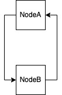
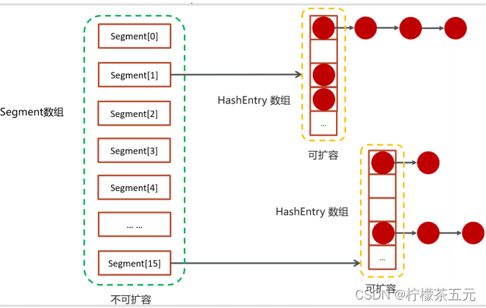
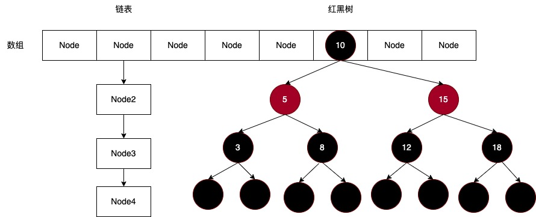

# ConcurrentHashMap在JDK1.7和JDK1.8区别

## 1 为什么出现ConcurrentHashMap？

​	ConcurrentHashMap的出现主要是为了解决 Java 在多线程环境下使用哈希表时面临的**线程安全（HashMap）**和**性能瓶颈（HashTable）**问题。具体原因：

### 1.1 HashMap线程不安全性问题‌

​	在并发环境下，多线程同时对 HashMap 执行put等操作可能导致死循环和数据不一致问题。
 **死循环原因‌**：

- 多线程扩容时可能形成**环形链表**（JDK7及之前版本头插法会使链表元素逆序），导致get等操作陷入无限循环，CPU占用率飙升。

  

- 多个线程同时对同一个红黑树进行写入数据时，可能导致父子节点相互引用（树平衡操作），形成循环，遍历时无法终止

 ‌**数据不一致‌**：并发修改可能导致数据覆盖或丢失

```	java
// 数据覆盖例子:
HashMap<Integer, String> map = new HashMap<>();
// 多线程执行put
for (int i = 0; i < 1000; i++) {
    map.put(i, Thread.currentThread().getName() + i);
}
// 不同线程操作同个下标i存在数据覆盖问题

// 数据丢失例子:
Map<String, Integer> counter = new HashMap<>();
// 多线程执行merge合并数量
map.merge("count", 1, Integer::sum);
// 在merge逻辑中，当一个线程put没完成，同时另外一个线程get再和合并数量导致数量丢失
```

### 1.2 HashTable 、SynchronizedMap的性能瓶颈‌

​	HashTable 、SynchronizedMap通过 `synchronized` 关键字实现线程安全，但锁粒度是‌整张表‌（全局锁）。所有读写操作均需竞争同一把锁，在高并发场景下线程阻塞严重，操作效率极低‌。即使多个线程操作哈希表不同数据段，也无法并行执行，无法充分利用多核CPU优势

### 1.3 ConcurrentHashMap核心目标

​	ConcurrentHashMap在JDK 5引入，属于Java并发包（java.util.concurrent）的重要组成部分。在保证**线程安全**的同时，尽可能提高**并发性能**，解决 `HashMap`的并发缺陷和 `HashTable` 的操作效率问题

## 2 ConcurrentHashMap在JDK1.7和JDK1.8区别

### 2.1 底层实现差异

#### 2.1.1 **JDK 1.7**底层结构

在 JDK 1.7 中，ConcurrentHashMap使用**分段锁**的设计，将整个哈希表分成多个段（Segment），是一个Segment 数组，每个段独立管理，有自己的锁，不同的段上可以并行读写，提高并发性能。

- **Segment 数组**：Segment继承 `ReentrantLock`（可重入锁），每个Segment维护一个哈希表，负责管理`一部分`键值对。
- **HashEntry 数组**：每个Segment维护一个HashEntry数组，数组中某个桶发生哈希冲突时会形成链表
- **实现线程安全**：通过 CAS原子操作 和 ReentrantLock 实现线程安全




#### **2.1.2 **JDK 1.7 Segment数组设计

​	 Segment 数组长度在**初始化**时需要确定，默认为16，后续不再改变，在运行时无法动态调整，这是分段锁实现核心设计之一。

**优点**

- 线程安全简化：每个Segment 独立加锁，线程只需竞争自己的Segment ，避免全局锁，提高并发效率；
- 无动态调整并发问题： Segment 数组本身无需扩容，避免了运行时动态调整 Segment 数组长度带来的并发问题；

**潜在问题**

- 负载不均衡：若某些 Segment 的 HashEntry 链表过长（热点数据集中），而其他 Segment 使用率低，会导致性能下降，无法全局平衡负载；
- 并发级别不可调：`concurrencyLevel` 在初始化后无法修改，无法根据运行时负载动态调整并发级别，若初始 `concurrencyLevel` 设置过低，高并发场景下锁竞争会加剧；若 `concurrencyLevel` 设置过高，若大部分时间实际并发线程较少，会导致大量 `Segment` 内存闲置，造成内存浪费；

#### **2.1.3 **JDK 1.8底层结构

在 JDK 1.8 中，ConcurrentHashMap 的底层结构发生了重大变化：

- **Node 数组**：取代了 `Segment`，整个哈希表由一个 `Node` 数组组成，类似于 `HashMap` 的实现。
- **链表 + 红黑树**：当链表长度超过阈值（默认 8）时，链表会转换为红黑树，优化查询性能。
- **实现线程安全**：通过 CAS原子操作 和 synchronized 实现线程安全，取代了分段锁



### 2.2 hash方法差异

#### **2.2.1 jdk1.7 hash方法**‌：

```java
private int hash(Object k) {
    int h = hashSeed;

    if ((0 != h) && (k instanceof String)) {
        return sun.misc.Hashing.stringHash32((String) k);
    }

    h ^= k.hashCode();

    // Spread bits to regularize both segment and index locations,
    // using variant of single-word Wang/Jenkins hash.
    h += (h <<  15) ^ 0xffffcd7d;
    h ^= (h >>> 10);
    h += (h <<   3);
    h ^= (h >>>  6);
    h += (h <<   2) + (h << 14);
    return h ^ (h >>> 16);
}
```

​	在JDK1.7中，键值对操作需要**两个定位**，先定位到具体的Segment，然后再定位到Segment内部的桶位置。这两个定位都依赖于hash方法的结果

**Segment定位公式**‌：

```java
int segmentIndex = (hash >>> segmentShift) & segmentMask;
```

**桶索引定位公式**‌：

```
int bucketIndex = hash & (table.length - 1);
```

**hash设计目标**‌：

​	复杂位运算和异或操作是‌专门为分段锁架构设计的**双重分布优化**（Segment级别和Segment内部桶）‌，不仅是为了分散哈希值，更是迎合适应分段锁设计：

- 数据在不同Segment间均匀分布
- Segment内部桶索引的良好分布，减少冲突

**问题**‌：用了7次位运算+4次异或运算，相比JDK1.8，计算步骤更多

#### **2.2.2 jdk1.8 hash方法**‌：

```java
static final int spread(int h) {
    return (h ^ (h >>> 16)) & HASH_BITS;
}
```

**优势**

用了1次异或运算+1次位运算+1次与运算，计算效率更高，同时保持较好的分布性

### 2.3 put方法差异

#### **2.3.1 jdk1.7 put方法**

​	对比HashMap，ConcurrentHashMap put操作实现线程安全，避免多线程写入数据覆盖和丢失、触发扩容可能死循环问题。

**流程**

1. key通过`Segment定位公式`定位到Segment，使用CAS机制检查Segment初始化(第一次获取进行初始化)；
2. Segment操作哈希表时使用ReentrantLock加锁，先尝试CAS获取锁，获取失败进入自旋循环尝试，自旋循环次数超过阈值使用阻塞式lock加锁；
3. 在Segment内部使用`桶索引定位公式`定位到下标，put元素分情况处理（空桶、链表）；

**自旋机制**

​	自旋机制是 jdk1.7高效并发性能和线程安全核心实现之一，通过非阻塞式尝试，超时转阻塞的策略，避免短暂时间获取不到锁直接进入阻塞状态，提高并发性能；

**自旋机制核心代码**

```java
final V put(K key, int hash, V value, boolean onlyIfAbsent) {
    HashEntry<K,V> node = tryLock() ? null :
   		scanAndLockForPut(key, hash, value);
    try {
        // put逻辑
    } finally {
        unlock();
    }
    return oldValue;
}

private HashEntry<K,V> scanAndLockForPut(K key, int hash, V value) {
    // ...代码省略
    while (!tryLock()) {
        if (retries < 0) {
            // ...代码省略
        }
        else if (++retries > MAX_SCAN_RETRIES) {
			// 阻塞式加锁
            lock();
            break;
        }
        else if 
			// ...代码省略
        }
    }
    return node;
}
```

**潜在问题**

- 多个线程对桶一个Segment写入数据时，必须排队，吞吐量受限

#### **2.3.2 jdk1.8 put方法**

​	 对比jdk1.7，jdk1.8不再使用分段锁机制，通过CAS + synchronized锁桶头节点，锁颗粒度细化到**桶级别**，减少锁竞争。

**流程**

1. key通过`hash方法`计算桶索引；
2. 空桶时通过CAS插入，否则通过synchronized锁定桶头节点，put元素分情况处理（链表、红黑树）；

### CAS机制

​	CAS（Compare and Swap）是一种无锁原子操作，广泛应用于并发编程中，例如常见AtomicInteger、ConcurrentHashMap、ReentrantLook等，核心思想是比较并交换：

- 三参数操作：V（内存值）、A（预期值）、B（新值）
- 操作逻辑：当内存值等于预期值时，将其更新为新值，否则不更新；
- 原子性：整个比较和交换操作通过**硬件指令**实现，确保不可中断

**伪代码**

```java
if (V == A) {
	V = B;
	return true;
} else {
    return false;
}
```

**CAS在ConcurrentHashMap应用**

​	 jdk1.7和jdk1.8 ConcurrentHashMap大量使用CAS操作来减少锁竞争，实现高效并发操作，例如哈希表初始化、新节点插入空桶、自旋机制等；

**CAS底层原理**

​	**CPU提供的原子指令通过硬件机制**确保操作不可中断性，原理是通过总线锁或缓存锁来保证多线程环境下对共享内存的原子访问。

- x86架构：CMPXCHG指令，在CMPXCHG指令执行时，CPU会锁住内存总线，防止其它CPU核心或线程访问目标内存地址；整个CMPXCHG操作由cpu单条指令完成，不可中断；
- ARM结构：LDREX/STREX指令；
- java实现：通过Unsafe类native方法调用

### 2.4 扩容方法差异

#### 2.4.1 jdk1.7 扩容机制

​	当执行put时，如果Segment中的元素超过阈值，会触发扩容操作，扩容在Segment内部进行。

**扩容流程**

1. 初始化计算：计算新容量、新阈值、新表创建；

2. 数据迁移：遍历表中每个桶，将节点重新散列到新表中。如果列表只有一个节点，直接放入新表对应位置，多节点使用**节点优化机制**，减少节点创建和复制，提升扩容效率；

3. 新节点（put方法节点）插入；

4. 表更新：将新表赋值给旧表，完成扩容；

**节点优化机制**

​	核心思想是通过遍历操作将链表分**两部分**处理，第一部分找到链表中**最后一组连续相同位置的节点**，这部分节点无需new实例化Node节点，直接插入新表，据统计，约节省六分之五节点克隆复制，第二部分将剩余部分元素克隆插入到新表正确位置（重新计算下标）

**示例**：

- 原链表 A -> B -> C -> D -> E，假设C、D、E新位置都相同
- 第一部分：将C插入表头，形成C -> D -> E链表，无需重新创建和构建HashEntry节点；
- 第二部分：将A、B重新计算新位置插入新表，这个过程需要创建和构建HashEntry节点

**扩容核心代码**

```java
private void rehash(HashEntry<K,V> node) {
	// ...变量赋值
    for (int i = 0; i < oldCapacity ; i++) {
      	// ...链表单节点直接插入新表
        HashEntry<K,V> lastRun = e;
        int lastIdx = idx;
        for (HashEntry<K,V> last = next; last != null; last = last.next) {
            int k = last.hash & sizeMask;
            if (k != lastIdx) {
                lastIdx = k;
                lastRun = last;
            }
        }
        newTable[lastIdx] = lastRun;
        // 克隆剩余节点
        for (HashEntry<K,V> p = e; p != lastRun; p = p.next) {
            V v = p.value;
            int h = p.hash;
            int k = h & sizeMask;
            HashEntry<K,V> n = newTable[k];
            newTable[k] = new HashEntry<K,V>(h, p.key, v, n);
        }
	// ...插入新节点 新表赋值旧表
}  
```

#### 2.4.2 jdk1.8 扩容机制

​	当写入数据后，如果哈希表中的元素数量超过阈值，会触发扩容操作。对比JDK1.7扩容机制，JDK1.8支持**多线程协助扩容**（协助扩容机制），在一个线程**正在进行**扩容时，另外线程写入数据时（涉及调用helpTransfer方法的操作put、replaceNode、clear、computeIfPresent、compute、merge...）会触发协助扩容，触发协助扩容的每个线程独立负责一部分桶数据迁移，提升扩容效率。

**扩容流程**

1. 新表初始化：创建新表nextTable，容量设置为旧表的两倍；
2. 桶迁移任务分配：每个线程通过transferIndex获取自己的迁移区间，根据cpu核心数分配任务粒度；
3. 空桶：直接插入`ForwardingNode`，标记哈希表正在迁移；
4. 链表迁移：和jdk1.7版本类似，有**节点优化机制**，桶迁移完成时设置`ForwardingNode`，同时代表哈希表正在迁移，这时如遇写操作可以协助扩容，读操作可以跳转到新表进行查询；
5. 红黑树迁移：类似链表；
6. 所有桶迁移完成后，新表赋值给旧表table = nextTable

**桶迁移任务分配**

​	线程领取区间从**尾部**开始进行，在实际应用场景，头部区域通常是**热点数据**，从尾部开始划分任务可以减少线程CAS竞争，这和**键的哈希值**和**哈希函数**有关。在实际应用场景中，小数值通常出现概率更多，例如1、2、3、a、b、c....，虽然ConcurrentHashMap哈希函数对哈希值进行了扰动处理，通常无法完全消除数据分布的不均匀性。类似场景例如在压缩算法中，小数使用频率通常出现频率高，会对小数区域进行算法优化。

划分示例：

假设3个线程参与迁移，数组数组长度为8，步长计算结果为3：

- 线程A领取 [5, 7]区间；
- 线程B领取 [2, 4]区间；
- 线程C领取 [0, 1]区间；

**单线程扩容和多线程扩容**

- 单线程扩容：扩容期间无其它线程写入数据，由触发线程完成整个扩容操作；
- 多线程扩容：扩容期间有其它线程写入数据时，触发协助扩容机制；

**协助扩容机制触发**

​	当扩容过程中遇到写数据会触发协助扩容机制，当桶迁移完成后继续写数据逻辑，例如在putVal方法触发：

```java
final V putVal(K key, V value, boolean onlyIfAbsent) {
	// ...代码省略
	// 死循环，如遇协助扩容，协助扩容完成后tab更新为新表，继续写入数据逻辑
    for (Node<K,V>[] tab = table;;) {
		// ...代码省略
        // ForwardingNode的哈希值为MOVED
        else if ((fh = f.hash) == MOVED)
			// 协助扩容 返回新表
            tab = helpTransfer(tab, f);
        else {
            // 继续写入数据逻辑
		}
	}
}
```

**扩容机制对比**

| 特性                 | JDK1.7                  | JDK1.8           |
| -------------------- | ----------------------- | ---------------- |
| **锁机制**           | 分段锁CAS+ReentrantLock | CAS+synchronized |
| **扩容触发条件**     | 超Segment内部哈希表阈值 | 超整张哈希表阈值 |
| **任务分配**         | 单线程完成              | 支持多线程协助   |
| **链表数据迁移优化** | lastRun机制减少克隆     | 类似JDK1.7       |

### 2.5 get方法差异

#### 2.5.1 jdk1.7 get方法

**读取步骤**

1. 定位到segment；
2. segment内部定位到桶，遍历桶元素

**问题**

- 当哈希冲突加剧时，可能导致链表过长，这时查找效率会降低

#### 2.5.2 jdk1.8 get方法

**读取步骤**

1. 定位到桶，找到直接返回；
2. 当遇到ForwardingNode，代表这个桶已经扩容完成，跳转到ForwardingNode查找；
3. 遍历链表或红黑树进行查找；

**读操作遇到正在扩容**

​	读操作可以感知扩容状态，当某个桶扩容处理完成时，会将这个节点设置为ForwardingNode，get可以读到最新的桶信息，无需等整张哈希表扩容完成，最新的桶信息对比旧桶可能节点数量更少（链表和红黑树节点被重新分布），优化读取效率

```java
public V get(Object key) {
	// ... 代码省略
    if ((tab = table) != null && (n = tab.length) > 0 &&
        (e = tabAt(tab, (n - 1) & h)) != null) {
        // ... 代码省略
        else if (eh < 0)
            // 当e是ForwardingNode时，跳转到ForwardingNode find方法
            return (p = e.find(h, key)) != null ? p.val : null;
		// ... 代码省略
    }
    return null;
}
```