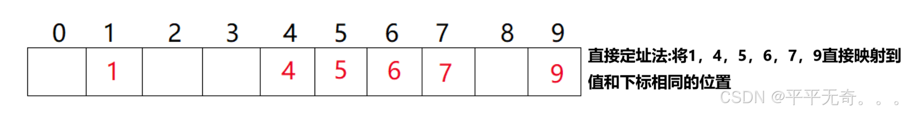
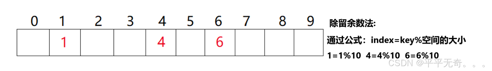
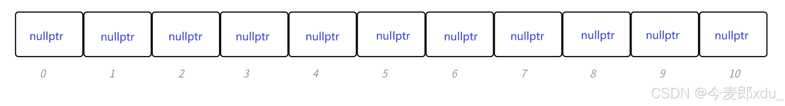
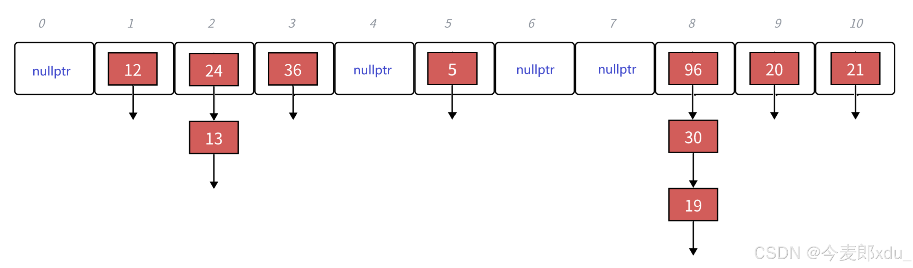

# HashMap在JDK1.7和JDK1.8的区别

1. ## HashMap应用场景

   ​	假设有10w条数据，每条数据有唯一key和对应的具体数据内容，使用何种数据结构能够根据key高效进行查找、插入、修改和删除操作？是使用数组、链表、二叉树or其它？ 

2. ## 哈希表

   ### 2.1 什么是哈希表

   ​	哈希表（Hash table），也叫散列表，基于**数组**实现，是一个根据关键字值（Key value）访问的数据结构。通过**哈希函数**把**关键字key** 跟**存储位置**建立一个映射关系，存放记录的数组叫做**哈希表**。

   ### **2.2 哈希函数**

   ​	哈希函数是指将哈希表中元素的关键值映射为元素存储位置的函数，一个好的哈希函数设计应该尽量让 N 个关键字被等概率的均匀的散列分布到哈希表的 M 个空间中。常见哈希函数实现有直接定址法、**除法散列法 / 除留余数法**（常用）、乘法散列法、全域散列法等；

   #### 2.2.1直接定址法

   ​	当关键字（ key）的范围比较集中时，直接定址法就是非常简单高效的方法，给每一个元素都映射一个唯一的位置：

   

   但是该方法有一定的局限性，就是我们首先要预先知道元素的分布情况，当关键字的范围比较分散时，会造成内存的浪费

   #### **2.2.2除法散列法 / 除留余数法（常用）**

   ​	在限定大小的空间内将元素值一一映射进去，映射的公式是index(下标)=key%空间大小

   

   ​	如果这时再插入14呢？通过公式算出14需要插入到的下标为4，但是我们发现4里面已经有数据了，我们把这种情况叫做**哈希冲突**，哈希表常用除留余数法作为哈希函数，实际应用场景中，哈希冲突是不可避免的，那么如何解决哈希冲突呢？主要有两种方法：**开放定址法**和**链地址法（常用）**

   ### **2.3 哈希冲突**

   #### **2.3.1开放定址法**

   ​	当一个关键字key 用哈希函数计算出的位置冲突了，则按照某种规则找到一个没有存储数据的位置进行存储。常见实现规则有三种：**线性探测、二次探测、双重探测**。当对元素进行操作时（插入元素、查找元素、删除元素）

   开放地址法的基本函数可以表示为：
    H(key) = (H(key) + f(i)) mod  m
    其中：

   - m为散列表长度
   - H(key)为散列函数
   - f(i)为增量序列
   - i为已经尝试计算索引的次数‌

   ##### 2.3.1.1 **线性探测**

   ​	当发生冲突时，顺序检查下一个位置(通常步长为1)，直到找到空位‌。

   ‌**示例**‌：
    假设哈希表大小为10，假设哈希函数为h(key)=key%10：

   - 插入12：h(12)=2 → 插入位置2
   - 插入22：h(22)=2 → 位置2已被占用，检查位置3 → 插入位置3
   - 插入32：h(32)=2 → 位置2和3已被占用，检查位置4 → 插入位置4

   ‌**特点**‌：

   - 实现简单
   - 容易产生"聚集"现象(冲突元素连续分布)
   - 最坏情况下查找时间复杂度可能退化‌

   **2.3.1.2 二次探测**

   使用第二个哈希函数计算探测步长‌

   **示例**‌：
   假设使用第一个哈希函数h1(key)=key%10，假设第二个哈希函数h2(key)=7-(key%7)：

   - 插入12：h1(12)=2 → 插入位置2
   - 插入22：h1(22)=2 → 位置2已被占用，h2(22)=3 → 检查位置5 (2+1×3) → 插入位置5
   - 插入32：h1(32)=2 → 位置2和5已被占用，h2(32)=1 → 检查位置3 (2+2×1=4) → 插入位置4

   ‌**特点**‌：

   - 产生最接近理想的均匀探测序列
   - 需要两个良好的哈希函数

   **2.3.1.2 开放地址法优缺点**

   ##### 优点

   1. ‌**内存效率高**‌：不需要额外的存储空间处理冲突，所有元素都存储在哈希表数组中‌
   2. ‌**缓存友好**‌：数据存储在连续内存位置，访问速度快‌
   3. ‌**实现相对简单**‌：特别是线性探测，代码实现直接‌

   ##### 缺点

   1. ‌**聚集问题**‌：特别是线性探测容易导致元素聚集，影响性能‌
   3. ‌**负载因子敏感**‌：当表接近满时性能急剧下降，通常需要保持较低负载因子(约0.7)‌

   ### **2.3.2链地址法**

   ​	主要思想是基于**数组和链表**的组合来解决冲突，桶（Bucket）中不直接存储键值对，每个桶都链接一个链表，当一个关键字key用哈希函数计算出的位置冲突时，把这些冲突的数据链接成一个链表，挂在哈希表这个位置的下面。链地址法也叫做**拉链法**。

   下面演示 { 19,30,5,36,13,20,21,12,24,96 } 这一组值映射到哈希表大小M=11中

   

   此时哈希函数为 h(key)=key % 11：

   其中，结点插入时相当于链表的**头插**，每个结点还要指向上一个冲突的结点，这样就能够通过遍历所有冲突值构成的链表找到想要寻找的值

   

   **特殊场景**

   某个桶可能会特别长，极端情况哈希表可能会直接降成单链表，导致查找效率降低。

   在Java8及之后的版本HashMap，链表长度超过 **8** 且数组容量 ≥ **64** 时，为了提高查找效率，会将链表转换成**红黑树**，

3. ## Java HashMap在JDK1.7和JDK1.8的区别

   ### 3.1 底层数据结构差异

   ​	JDK1.7及之前HashMap底层数据结构采用数组+链表，JDK1.8及之后使用数组+链表+红黑树。

   ​	当HashMap中的一个桶（bucket）内的链表长度超过 **8** 且数组容量 ≥ **64** 时，为了提高元素操作效率，会将这个链表转换为红黑树。目的是为了减少在链表中的查找时间（复杂度O(n)），通过使用红黑树结构将查找时间复杂度优化到O(log n)；当红黑树节点数 ≤ **6** 时，红黑树退化为链表

   ### 3.2 hash方法差异

   ​	目的是分散哈希值，减少哈希碰撞概率，将元素均匀的散列分布到哈希表中

   JDK1.7：用了多次扰动（4次位运算+5次异或运算）

   ```java
   final int hash(Object k) {
       int h = hashSeed;
       if (0 != h && k instanceof String) {
           return sun.misc.Hashing.stringHash32((String) k);
       }
   
       h ^= k.hashCode();
   
       h ^= (h >>> 20) ^ (h >>> 12);
       return h ^ (h >>> 7) ^ (h >>> 4);
   }
   ```

   **问题**

   - 相比JDK1.8计算步骤更多

   JDK1.8：只用了1次位运算+1次异或运算

   ```java
   static final int hash(Object key) {
       int h;
       return (key == null) ? 0 : (h = key.hashCode()) ^ (h >>> 16);
   }
   ```

   **优势**

   - 计算效率更高，同时保持较好的分布性。

   ### 3.3 扩容条件触发差异

   ​	当键值对数量超过阈值时，哈希冲突的概率会显著增加，为了降低哈希冲突率提高增删查节点效率，HashMap 会触发扩容操作，当满足以下条件时，HashMap会进行扩容：

   #### 3.3.1 JDK 1.7先检查扩容后插入

   需同时满足2个条件：

   - 当前元素数量 ≥ 阈值（容量 × 负载因子）
   - 当前插入位置非空（发生哈希冲突）‌

   将扩容与哈希冲突绑定，当未发生哈希冲突时即使达到扩容阈值也不会马上触发扩容，导致扩容滞后，极端情况可能会加剧哈希冲突

   #### 3.3.2 JDK 1.8先插入后检查扩容+特殊情况

   满足其一条件：

   - 无论当前容量是否足够，先插入，若插入后元素数量 > 阈值，触发扩容；
   - 即使当前容量未达到阈值，如果某个桶中的链表长度达到8且当前数组容量小于64，触发扩容。

   ### **3.4 链表插入元素差异**

   在链表插入元素时， JDK1.7中使用**头插法**，JDK1.8使用**尾插法**

   #### **3.4.1链表插入操作**

   当我们调用 put(key, value) 方法时，HashMap 会：

   - 计算 key 的哈希值，确定它应该放在哪个桶。
   - 如果桶是空的，直接放入键值对。
   - 如果桶里已经有数据（冲突），需要将新键值对插入到这个桶的链表中。插入时，有两种方式：头插法（插到链表头部）和 尾插法（插到链表尾部）

   #### **3.4.2头插法**

   ​	头插法是指将新插入的键值对节点放在链表的**头部**，如果用3个整形数`1，2，3`来创建链表，如果按照数字升序输入数据，那么用头插法创建后得到的链表则为`3->2->1`

   ##### 为什么用头插法？

   - **效率高**：头插法只需要修改链表头部的指针，无需遍历整个链表，时间复杂度是 O(1)。
   - **简单**：只需要将新节点的 `next` 指针指向原来的头部节点，再更新桶的引用指向新节点即可。

   ##### 头插法的缺点

   ​	头插法在 多线程环境下和扩容时存在问题：

   ##### 问题 1：多线程并发问题

   ​	在 Java 7 中，HashMap 不是线程安全的。如果多个线程同时操作 HashMap（比如 `put` 或 `resize`），可能导致：

   - **数据丢失**：线程 A 和线程 B 同时插入新节点，可能覆盖彼此的操作
   - **死循环**：在多线程扩容时，头插法可能导致链表形成环

   ##### 问题 2：扩容时的死循环

   ​	HashMap 在扩容操作会将所有节点重新分配到新的桶中。由于头插法在重新插入节点时会**反转链表**顺序，在多线程环境下可能导致链表形成环。

   **扩容过程：**

   - 创建一个更大的数组（原来的两倍）。
   - 将旧数组中的每个节点**重新计算位置**，放入新数组的对应桶。
   - 由于头插法，新链表的顺序会与旧链表**相反**

   **举例**：

   - 假设旧数组的桶 i 有一个链表：[A -> B -> C]
   - 扩容后，节点按头插法插入新数组，变成：新桶 j: [C -> B -> A]
   - 在多线程环境下，线程 A 和线程 B 可能同时操作链表，导致指针混乱，最终形成环，例如：[A -> B -> A]，这种环会导致 `get` 或其他操作陷入死循环，CPU 使用率飙升

   **transfer方法源码分析**；**死循环例子代码**

   ####  **3.4.3尾插法**

   ​	尾插法是指将新插入的键值对节点放在链表的尾部。从 Java 8 开始，HashMap 改用尾插法来解决头插法在扩容时的死循环问题。如果用3个整形数`1，2，3`来创建链表，如果按照数字升序输入数据，那么用尾插法创建后得到的链表则为`1->2->3`

   ##### 为什么用尾插法？

   避免链表成环死循环，尾插法在扩容时保持链表的相对顺序，避免了头插法导致的顺序反转，从而消除了多线程环境下链表成环的风险

   **尾插法的缺点**

   插入比头插法慢，需要遍历链表找到尾节点，这部分遍历元素时间复杂度为O(n)

   - HashMap 的设计目标是让链表尽量短，通过哈希函数和扩容机制，减少链表操作复杂度。
   - 在 Java 8 中，如果链表长度超过 8，链表会转为红黑树，进一步优化性能

   ### **3.5 红黑树优化链表查询**

   ​	当链表长度超过 **8** 且数组容量 ≥ **64** 时，为了提高查找效率，会将链表转换成**红黑树**。

   **为什么不使用二叉搜索树优化链表查询？**

   如果二叉搜索树的节点正好从大到小的插入，此时形成一条链，查找的时间复杂度从O ( log n）也将退化成O ( N )；

   

   **为什么不使用平衡二叉树优化链表查询？**

   ​	平衡二叉树高度差不能超过1，每次进行插入/删除操作时，几乎都需要通过**旋转操作**保持平衡，

   在频繁进行插入/删除的场景中，频繁的旋转操作会增加性能消耗，更适合读多写少场景。

   红黑树通过牺牲严格的平衡，换取插入/删除时少量的旋转操作

4. ### 红黑树并发操作死循环

   ​	虽然JDK1.8通过尾插法解决了1.7版本的环形链表问题，但在特定条件下HashMap仍会出现死循环。

   问题发生在`TreeNode.balanceInsertion`方法。在多线程环境下，当多个线程同时对同一个红黑树进行结构调整时，可能导致：

   - 父子节点相互引用，形成循环依赖
   - 红黑树性质被破坏，导致平衡调整进入无限循环
   - 节点指针被错误修改，遍历时无法终止

   **死循环例子代码**

5. ## **HashMap**插入、删除和查找时间复杂度

   - 无哈希冲突：O(1)
   - 哈希冲突形成链表：链表元素操作部分O(n)
   - 哈希冲突形成二叉树：二叉树元素操作部分O ( log n）