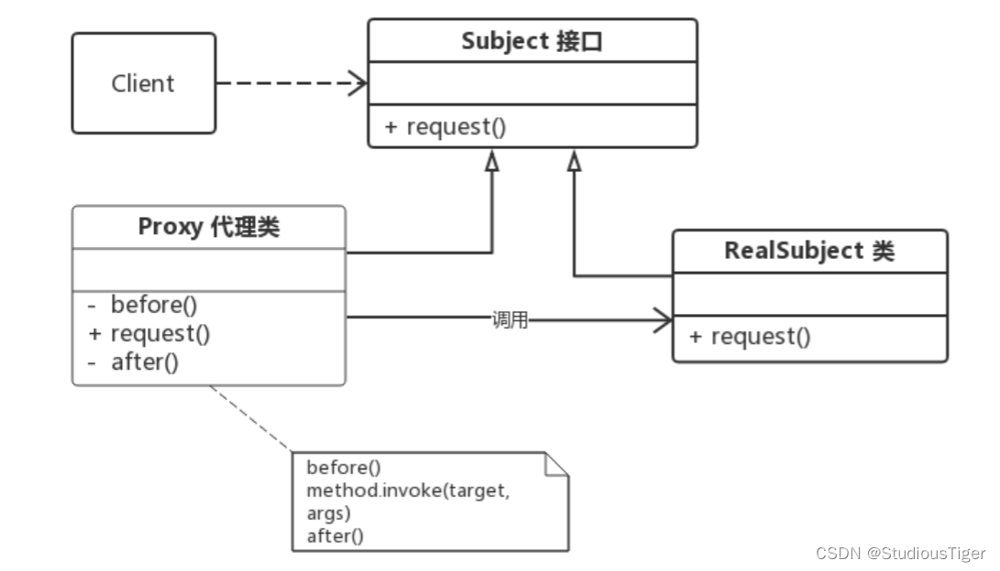
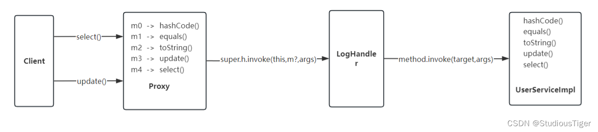
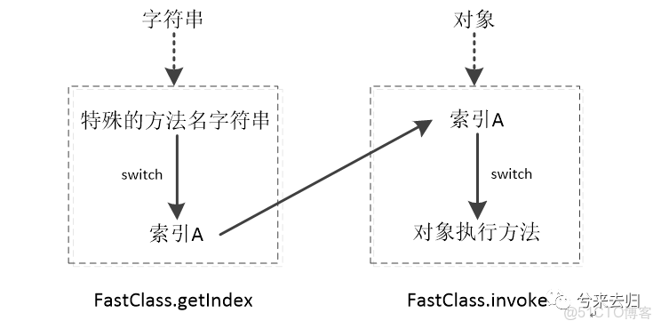

# Java动态代理机制

## 1. 前言

​	动态代理在Java中有着广泛的应用，比如 Spring AOP、RPC 远程调用、Java 注解对象获取、日志、用户鉴权、全局性异常处理、性能监控，事务处理等。下面着重的介绍两个常用的动态代理：**JDK原生动态代理**和 **CGLIB 动态代理**。

## 2. 代理模式

​	当我们谈及Java的**动态代理**或者是**静态代理** ，我们都很容易谈及到设计模式中的—— **代理模式**。在这里我想要提出几个问题，什么是代理模式？代理模式的构成是怎想的？如何实现代理模式？代理模式在实际开发中的作用是什么？Java的动态代理与设计代理模式有什么关系？如何实现Java的动态代理？

**代理模式的定义：**

- 代理模式是给某一个对象提供一个代理，并由代理对象来控制对真实对象的访问，起到对代理对象已有功能的增强；
- 代理模式是一种结构型设计模式。

**代理模式一般会存在三个角色：**

1、**抽象主题角色（Subject）**

- 抽象主题角色指的是**真实对象**与**代理对象**的公共的法所抽象出来的一个接口或者是抽象类

2、**真实主题角色（RealSubject）**

- 真实主题角色指的是被代理对象

3、**代理主题角色（ProxySubject）**

- 代理主题角色指的是代理对象

代理模式核心是代理类，为了让客户端能够一致性地对待真实对象和代理对象，在代理模式中引入了抽象层。



如果根据**字节码的创建时机**来分类，可以分为**静态代理**和**动态代理**：

**静态代理**

所谓**“静态”**也就是在**程序运行前**就已经存在代理类的字节码文件，代理类和真实主题角色的关系在运行前就确定了

**动态代理**

而**动态代理**的源码是在**程序运行期间**由 JVM 根据反射等机制动态的生成，所以在运行前并不存在代理类的字节码文件。

## 3. 静态代理

在了解**动态代理**之前，我们先了解一下**静态代理** 。无论动态代理还是静态代理，都是代理模式的一种实现。下面我们将实现一套基础的 静态代理代码 

**定义抽象主题接口**（上面我们已经介绍了抽象主题对象就是接口或抽象类）。此案例中我们使用接口。

```java
// 定义接口
interface Subject {
    void request();
}
```

**定义真实主题类**

```java
// 定义被代理类
class RealSubject implements Subject {
    @Override
    public void request() {
        System.out.println("Do invoke request(), now.");
    }
}
```

**定义抽象主题类**

```java
// 定义代理类
class ProxySubject implements Subject {
    private Subject realSubject;
    
    public ProxySubject(Subject realSubject) {
        this.realSubject = realSubject;
    }

    @Override
    public void request() {
        before();
        realSubject.request();
        after();
    }

    private void before() {
        System.out.println("准备开始执行方法...");
    }

    private void after() {
        System.out.println("方法方法执行结束...");
    }

}
```

**定义客户端，查看执行效果**

```java
public class Client{
    public static void main(String[] args) {
        Subject realSubject = new RealSubject();
        Subject proxySubject = new ProxySubject(realSubject);
        proxySubject.request();
    }
}
```

输出结果：

```java
准备开始执行方法...
Do invoke request(), now.
方法方法执行结束...
```

​	这样，我们就完成了一个静态代理的编写。从上面的代码我们不难发现 静态代理 存在一个问题，代理主题类与真实主题类之间的**耦合程度**太高 ，当真实主题类中增加、删除、修改方法后，那么代理主题类中的也必须增加、删除、修改相应的方法，提高了代码的维护成本。另一个问题就是当代理对象代理多个 Subject 的实现类时，多个实现类中必然出在不同的方法，由于代理对象要实现与目标对象一致的接口（其实是包含关系），必然需要编写众多的方法，极其容易造成臃肿且难以维护的代码。相比与于静态代理，动态代理则不存在上述的诸多问题，下面我们进入 JDK 的动态代理。

## 4. 动态代理

​	静态代理最主要的问题是静态代理类需要对被代理类做手动的方法映射。造成这个问题的原因是代理对象是通过**硬编码**得到的，是在程序编译前就已经存在的，所以顺着这个思路，我们不难得到一个方向，如何代理对象不是通过硬编码提前写好的，而是在**程序运行中动态生产**的，且生成的代理对象可以对被代理类的方法**自动映射**，这也就是动态代理的大致解决方案。

### **4.1 JDK原生动态代理**

JDK原生动态代理的组成分为三个部分：抽象主题角色 、真实主题角色 、增强主题角色 。

**抽象主题角色**：和代理模式的抽象主题角色是一样的，都是抽象出来的接口或类，对于JDK原生动态代理而言，抽象主题角色就是接口。

**真实主题角色：**和代理模式的真实主题角色一样，都是被代理类。

**增强主题角色：**在JDK原生代理中值的是实现了 **InvocationHandler接口**的类，其目的是对真实主题角色的方法的增强。 InvocationHandler 接口中**只有一个方法 invoke 方法**，所有的动态代理对象中的映射方法在执行时都是调用的 InvocationHandler 接口中的 invoke 方法，在调用 invoke 方法时，动态代理对象会将 被代理对象的方法 和 动态代理对象映射的方法的参数 传递给 InvocationHandler 的 invoke 方法， invoke 方法的实现由程序编写，这样就可以在 被代理对象的方法 执行 前后 进行增强。

下面我们来实现一下JDK原生动态代理

**1、定义抽象主题角色接口 `UserService`**

```java
public interface UserService {
    public void select();
    public void update();
}
```

**2、定义真实主题角色类 UserServiceImpl**

```java
public class UserServiceImpl implements UserService {
    @Override
    public void select() {
        System.out.println("执行UserService.select()方法");
    }

    @Override
    public void update() {
        System.out.println("执行UserService.update()方法");
    }
}
```

**3、定义增加主题角色类 LogHandler**

```java
public class LogHandler implements InvocationHandler {
    // 真实的被代理对象
    Object target;

    public LogHandler(Object target) {
        this.target = target;
    }

    @Override
    public Object invoke(Object proxy, Method method, Object[] args) throws Throwable {
        // 真实方法执行前的增强
        before(method.getName());
        // 真实方法执行
        Object result = method.invoke(target, args);
        after(method.getName());
        // 真实方法执行后的增强
        return result;
    }

    private void before(String methodName) {
        System.out.printf("[%s] 准备开始执行%s方法%n", new Date(), methodName);
    }

    private void after(String methodName) {
        System.out.printf("[%s] %s方法方法执行结束%n", new Date(), methodName);
    }

}
```

**4、编写客户端（其中有生产JDK原生动态代理的核心代码）**

```java
public class Client {
    public static void main(String[] args) {
        // 实例化被代理对象
        UserService targetInstance = new UserServiceImpl();

        // 获取被代理对象的类加载器，用作生成代理对象的必要参数
        ClassLoader classLoader = targetInstance.getClass().getClassLoader();

        // 获取被代理对象的实现接口，用作生成代理对象的必要参数
        // 方法映射就是基于这个参数实现的
        Class<?>[] interfaces = targetInstance.getClass().getInterfaces();

        // 获取被代理对象的增强主题类，用作生成代理对象的必要参数
        LogHandler logHandler = new LogHandler(targetInstance);

        // 生成代理对象的核心代码！！！！
        UserService proxyInstance = (UserService)Proxy.newProxyInstance(classLoader, interfaces, logHandler);

        // 使用代理对象执行方法
        proxyInstance.select();
        System.out.println();
        proxyInstance.update();
	}
}
```

**5、执行结果：**

```java
准备开始执行select方法
执行UserService.select()方法
select方法方法执行结束

准备开始执行update方法
执行UserService.update()方法
update方法方法执行结束
```

**6、JDK原生的动态代理执行过程如下图所示：**



**7、JDK原生的动态代理应用**

1. **Spring框架中JdkDynamicAopProxy** ‌

   Spring框架bean代理选择策略‌：

   - 若目标类实现了接口，默认使用JDK代理。
   - 若无接口，则使用CGLIB。
   - 可通过配置或注解强制使用CGLIB。

   JdkDynamicAopProxy代理类是spring 的JDK动态的代理类实现。它实现了Java 动态代理接口InvocationHandler接口和Spring定义的AopProxy接口。AopProxy定义了返回代理的对象：

   ```java
   final class JdkDynamicAopProxy implements AopProxy, InvocationHandler, Serializable {
    ...
       public Object getProxy(ClassLoader classLoader) {
   		if (logger.isTraceEnabled()) {
   			logger.trace("Creating JDK dynamic proxy: " + this.advised.getTargetSource());
   		}
   		Class<?>[] proxiedInterfaces = AopProxyUtils.completeProxiedInterfaces(this.advised, true);
   		findDefinedEqualsAndHashCodeMethods(proxiedInterfaces);
   		return Proxy.newProxyInstance(classLoader, proxiedInterfaces, this);
       }
      ...
          
      public Object invoke(Object proxy, Method method, Object[] args) throws Throwable {
          // 处理目标对象调用、切面等逻辑
      }
   }
   ```

   当通过代理对象调用方法时，实际的方法调用会被 `InvocationHandler` 的 `invoke` 方法拦截。在这个 `invoke` 方法中，Spring 能够检查是否有匹配的切面（Advice）应用于当前方法，并相应地执行前置通知、后置通知等

2. 

**8、JDK动态代理优缺点**

实现方式：通过 `java.lang.reflect.Proxy` 和 `InvocationHandler` 接口生成代理类，代理对象需实现目标接口‌

**优点**

1. **运行时增强**：可以在运行时动态地添加功能，无需修改原有代码。
2. **灵活性**：适用于多种场景，如事务管理、日志记录、权限控制等。
3. **简化代码**：通过代理模式，可以将横切关注点从业务逻辑中分离出来，使代码更加清晰。
4. **易于实现接口**：动态代理可以轻松地实现一个或多个接口，而不需要手动编写实现类。

**缺点**

1. **性能开销**：相比于直接调用方法，通过反射和代理调用方法会有一定的性能损耗。

2. **复杂度增加**：使用动态代理会增加系统的复杂度，特别是在处理复杂的调用链和异常处理时。

3. **限制于接口**：只能用于实现了接口的类，对于没有实现接口的类（如具体类或final类），不能使用JDK动态代理。

4. **调试困难**：动态代理生成的代码不容易被调试工具识别，可能会增加调试的难度。

   

**java动态代理为啥代理是接口，不能是类？**

JDK的动态代理实现方式是代理对象继承了java.lang.reflect.Proxy，并且java单继承，所以无法代理类

### **4.2 CGLIB动态代理**

​	在上面的 4.1 JDK原生动态代理 模块中，我们知道动态代理的实现是基于**接口**实现的。本章我们将介绍 CGLIB动态代理 ，CGLIB 实现动态代理的方式与 JDK 代理略有区别，CGLIB 是基于**继承**实现的动态代理，CGLIB 会生成一个**动态代理子类**，这个子类需要重写被代理对象的所有非 final 方法，在子类中采用**方法拦截**所有的父类方法调用，顺势织入横切逻辑。在介绍基于 CGLIB 实现动态代理之前，我想先说一下实现动态代理需要实现的几个模块：

- 被代理对象（普通类，不要求需要实现什么接口）；
- 增强类（我们需要代理的目的就是为了实现对原本方法的增强），所有的增强逻辑都基于它来实现，增强类需要实现 CGLIB 的**MethodInterceptor接口**，并重写其中唯一一个方法 intercept，后面操作就可 JDK 的动态代理类似了，基于intercept 方法区执行被代理类的方法，并在方法执行前后完成对被代理方法的增强；
- 最后，我们需要基于 CGLIB 的对象生成目标对象的被代理对象。

下面是基于 CGLIB 实现动态代理的案例：
**1. 编写一个被代理对象 UserService ：**

```java
public class UserService {
    public void select() {
        System.out.println("执行UserService.select()方法");
    }
    public void update() {
        System.out.println("执行UserService.update()方法");
    }
}
```
**2. 编写对被代理对象的增强类 LogInterceptor ：**

```java
public class LogInterceptor implements MethodInterceptor {
    /**
     *
     * @param o           表示要增强的对象（被代理对象）
     * @param method      表示被拦截的方法
     * @param objects     表示参数列表
     * @param methodProxy 表示对连接方法的代理,invokeSuper方法表示对被代理对象方法的调用
     */
    @Override
    public Object intercept(Object o, Method method, Object[] objects, MethodProxy methodProxy) throws Throwable {
        // 前置增强
        before(method.getName());
        // 调用被实际方法
        Object result = methodProxy.invokeSuper(o, objects);
        // 后置增强
        after(method.getName());
        // 返回实际对象的结果
        return result;
    }
    private void before(String methodName) {
        System.out.printf("[%s] 准备开始执行%s方法%n", new Date(), methodName);
    }
    private void after(String methodName) {
        System.out.printf("[%s] %s方法方法执行结束%n", new Date(), methodName);
    }
}

```

**3. 生成代理对象并执行代理方法：**

```java
public class Client {
    public static void main(String[] args) {
        // Enhancer 为 CGLIB 代理增强类
        Enhancer enhancer = new Enhancer();
        // 设置被代理类（父类），以便 CGLIB 去生成该类的子类
        enhancer.setSuperclass(UserService.class);
        // 你可以认为是设置增强方法
        enhancer.setCallback(new LogInterceptor());

        // 生成代理对象
        UserService proxy = (UserService) enhancer.create();
        
        // 执行代理方法
        proxy.select();
        System.out.println();
        proxy.update();
    }
}

```

输出结果：

```java
[Thu Feb 22 17:46:18 CST 2024] 准备开始执行select方法
执行UserService.select()方法
[Thu Feb 22 17:46:18 CST 2024] select方法方法执行结束

[Thu Feb 22 17:46:18 CST 2024] 准备开始执行update方法
执行UserService.update()方法
[Thu Feb 22 17:46:18 CST 2024] update方法方法执行结束

```

**4. FastClass机制**	

​	**Jdk动态代理**的拦截对象是通过**反射**的机制来调用被拦截实例方法的，反射的效率较低，所以**cglib**采用了**FastClass机制**来实现对被拦截方法的调用。CGLIB代理会为每个目标对象**生成3个Class文件**，FastClass机制会对一个类的方法**建立索引**，调用方法时根据方法的签名来计算索引，通过索引来直接调用相应的方法，

**3个class文件：**

- 代理类，继承被代理类
- 代理类的FastClass类；
- 被代理类的FastClass类；


**调用流程：**




**5.自定义增强**

​	现在有这么一个需求，对于同一个代理对象中的不同方法，我想实现不同的增强逻辑，应该如何优雅的实现。CGLIB 中支持对一个类设置多个不同的增强类，想要实现对同一个类的不同方法实现差异性增强，我们需要多写一个代理过滤器，以便可以为不同的方法分配不同的增强方案。

大概实现方案如下：

1. 通过在方法上 引用 不同的**自定义注解**去，去区分不同方法的增强方案。
2. 编写多个增强类（实现类MethodInterceptor接口的类）去实现不同的增强逻辑。下面编写一个**日志增强**和 **参数校验增强**。
3. 基于CGLIB特性生成多重增强代理类。

编写参数检查注解 CheckProxy 和日志注解 LogProxy，**代码示例**：

## 5.JDK代理与CGLIB对比

| **特性**‌     | ‌**JDK动态代理**‌ | ‌**CGLIB动态代理**‌    |
| ------------ | --------------- | -------------------- |
| ‌**代理方式**‌ | 基于接口        | 基于继承             |
| ‌**性能**‌     | 反射调用较慢    | FastClass优化更快    |
| ‌**依赖**‌     | 无需额外库      | 需引入CGLIB          |
| ‌**限制**‌     | 必须实现接口    | 无法代理final类/方法 |

## 6. 总结

​	动态代用于在不修改原有代码的情况下通过代理实现增加额外的功能，JDK动态代理与CGLIB分别代表了基于接口和继承的代理实现方式，两者在性能、灵活性上各有优劣，在选择是否使用动态代理时，需要权衡其优缺点，并考虑具体的应用场景。对于一些特定的场景，如需要性能要求极高的情况，可以考虑使用CGLIB库来实现AOP

