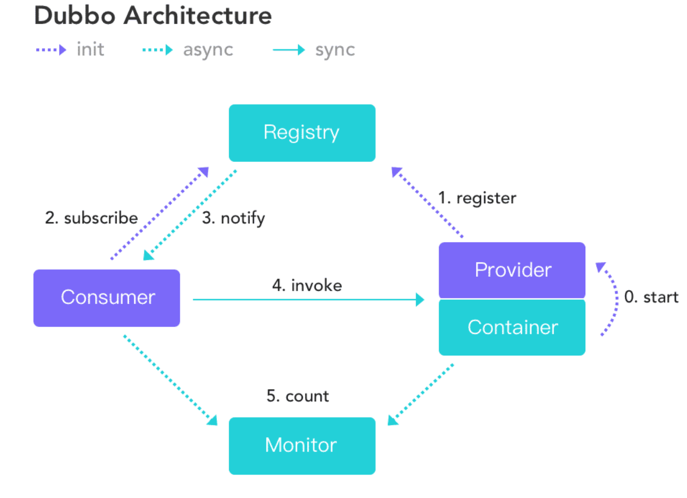

# dubbo-rpc

1. ## 什么是RPC？

   RPC（Remote Procedure Call） 即远程过程调用，RPC主要关注的是调用远程的方法。为什么需要RPC？假如现在有两台服务器A和B，一个应用部署在A服务器上，想要调用B服务器上应用提供的方法，由于不在一个内存空间，不能直接调用，需要通过网络来表达调用的语义和传达调用的数据

       1. 服务器A和服务器B各自开一个网络收发服务
       2. A通过网络编程传输要调用的方法和参数等信息给服务器B
       3. 服务器B将本地方法调用后的结果通过网络返回给A
       4. A解析B返回的结果

   上面的步骤具体技术实现是非常复杂的，不仅要考虑如何对服务接口进行内部封装，对传输的数据进行序列化和反序列化、调用完回调等等，而RPC框架封装了底层实现细节，基于rpc框架调用本地方法即可实现调用远程方法效果
   
2. ## RPC工作原理

   RPC的设计由Client，Client stub，Network ，Server stub，Server构成。 其中Client是用来调用服务的，Cient stub主要职责是把调用的**类、方法、方法参数**等信息序列化（因为要在网络中传输，需要要把对象转变成字节），Network用来传输这些信息到Server stub， Server stub用来把这些信息反序列化，Server就是服务的提供者，最终调用的就是Server提供的方法

   

3. ## 常见RPC技术实现方案

   ### 3.1 基于代理的调用

   **工作原理‌**
   客户端通过‌本地代理存根（Stub）‌ 封装调用请求，序列化参数后发送至服务端。
   服务端‌骨架（Skeleton）‌ 接收请求，反序列化参数并执行本地方法，再将结果返回客户端‌
   **典型框架‌**
   Dubbo‌：分布式服务框架，通过代理模式实现服务发现与负载均衡。其核心包括服务注册中心、代理对象和负载均衡策略等；

   Spring Cloud：基于SpringBoot的微服务全家桶，通过微服务架构整合了代理模式，提供服务发现、路由、断路器等组件。其核心组件包括服务注册中心（如Consul）、负载均衡器（如Ribbon）和API网关（如Zuul）

   Java RMI‌：基于Java原生序列化，依赖RMI注册中心定位服务‌

   **适用场景**

   利用长连接提高频繁数据传输效率、精细的服务治理

   ### 3.2 接口语言IDL模式

   **工作原理‌**

   使用接口定义语言（IDL）预定义服务协议（如Protobuf、Thrift）
   使用工具生成多语言客户端/服务端代码，确保跨语言一致性

   **典型框架‌**

   gRPC：基于HTTP/2协议，默认采用Protobuf二进制编码，
   Apache Thrift：支持多种传输协议和序列化格式

   **适用场景**

   跨语言兼容性强，通过口定义语言（IDL）屏蔽各语言实现差异，例如在python和C++交互中，Python调用C++服务时，Python端生成代理对象处理请求编码

   ### 3.3 实现方案对比

   | 维度‌ | Dubbo RPC‌ | **Spring Cloud RPC**‌          | RMI              | gRPC              | **Apache Thrift** |
   | --------------------------------------------------------- | ------------------------------------------------------------ | ----------------------------- | ---------------- | ----------------- | ----------------- |
   | **服务提供方式**                                          | 基于代理                                                     | 基于代理                      | 基于代理         | 基于接口语言      | 基于接口语言      |
   | **通信协议**                                              | TCP(长连接)                                                  | 默认 HTTP + RESTful（短连接） | TCP/HTTP（JRMP） | HTTP/2 + Protobuf | TCP               |
   | **序列化**‌                                                | 二进制编码（如 Hessian）                                     | 文本格式（JSON/XML）‌          | Java 原生序列化  | Protocol Buffers  | Binary/Compact    |
   | **适用场景**‌                                              | 长连接双向通信                                               | 开放 API、跨平台调用‌          |                  | 跨语言支持        | 跨语言支持        |
   
4. ## 为什么使用Dubbo？

   - 面向分布式架构：面向服务，SOA 面向服务的架构（Service Oriented Architecture），将复杂的系统拆分成不同的服务，这些服务放在不同的服务器上减轻单体服务的压力提高并发量和性能，dubbo提供注册发现服务、负载均衡策略等；
   - 高效通信协议‌：采用自定义 ‌TCP 长连接 + 二进制序列化‌（Hessian/Kryo），通讯底层基于netty；
   - 集群容错与高可用‌：提供 Failover/Failfast 等策略，结合 ZooKeeper/Nacos 注册中心实现故障转移
   - 智能负载均衡机制‌：内置随机/轮询/最少活跃调用等策略，动态感知节点负载状态，避免单点瓶颈
   - 融入Spring生态：适配spring、springboot项目、注解驱动(@DubboService、@Reference等)、Dubbo服务挂载到Spring容器生命周期、适配spring配置(xml、properties‌、yml)
   - 分层架构：分层设计和管理，框架将接口层、配置层、服务接口代理层等十层抽象设计，每一层都可以剥离上层被复用，其中，Service和Config 层为 API，其它各层均为SPI

5. ## Dubbo概述

   Apache开源的高性能Java RPC框架，用于解决微服务架构下的服务治理与通信问题，官方提供了 Java、Golang 等多语言 SDK 实现。使用Dubbo 开发的微服务原生具备相互之间的远程地址发现与通信能力，利用 Dubbo 提供的丰富服务治理特性，可以实现诸如服务发现、负载均衡、流量调度等服务治理需求。

6. ### **Dubbo 的架构**

   ​	

   上述节点简单说明：

   - **Provider**： 暴露服务的服务提供方
   - **Consumer**： 调用远程服务的服务消费方
   - **Registry**： 服务注册与发现的注册中心
   - **Monitor**： 统计服务的调用次数和调用时间的监控中心
   - **Container**： 服务运行容器

   调用关系说明：

   - 服务容器负责启动，加载，运行服务提供者。
   - 服务提供者在启动时，向注册中心注册自己提供的服务。
   - 服务消费者在启动时，向注册中心订阅自己所需的服务。
   - 注册中心返回服务提供者地址列表给消费者，如果有变更，注册中心将基于长连接推送变更数据给消费者。
   - 服务消费者，从提供者地址列表中，基于软负载均衡算法，选一台提供者进行调用，如果调用失败，再选另一台调用。
   - 服务消费者和提供者，在内存中累计调用次数和调用时间，定时发送一次统计数据到监控中心。

7. ### 简单的dubbo rpc demo示例

   demo主要展示两个内容：

   1. 服务提供方暴露服务，提供rpc调用接口
   2. 消费者异步调用服务，引用调用接口

   该demo跳过注册中心(ZooKeeper/Nacos)管理服务，消费者采用直连方式连接服务提供方