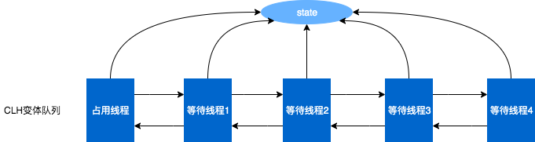
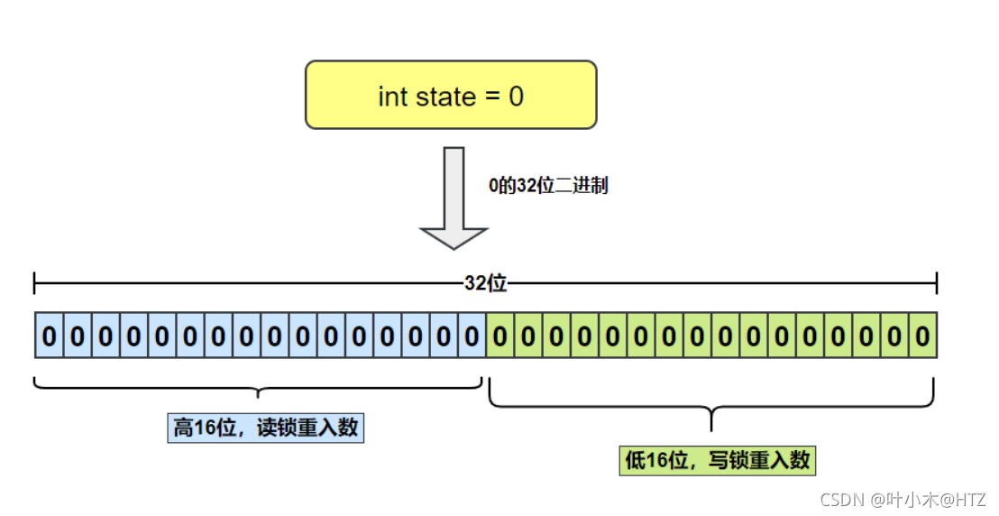

# java常见锁工作机制

## 1 为什么需要锁？

​	多个线程同时访问共享资源（如变量、数据结构）时，可能导致数据竞争 ，从而破坏数据的一致性。 例如：

- 多线程递增一个共享变量（如count++ ）时，可能因为**指令重排序**或**CPU缓存不一致**导致结果不一致；
- 修改共享数据时未同步，可能读取到中间状态（如未完成初始化的对象）

**解决多线程三大核心问题**

- 原子性问题：锁可以将一段代码标记为“原子操作”，这一操作必须由一个线程独占运行，避免被其它线程打断；

- 可见性问题：释放锁时，当前线程的修改对其它线程可见（例如使用volatile、锁）

- 有序性问题：加锁操作可以防止编译器/处理器优化导致指令重排影响程序正确性；

**常见锁**

- 基于Lock接口：ReentrantLock、ReentrantReadWriteLock；
- synchronized；
- CAS；
- StampedLock；
- Semaphore；
- CountDownLatch；
- CyclicBarrier；

## 2 ReentrantLock

​	ReentrantLock也被称为“可重入锁”，是一个同步工具类，在java.util.concurrent目录包下。这种锁的一个重要特点是，它允许一个线程多次获取同一个锁而不会产生死锁，这与`synchronized`关键字提供的锁定机制相似，但ReentrantLock提供了更高的扩展性（超时、尝试获取、中断敏感的尝试、条件获取）

### 2.1 ReentrantLock常用示例

**存钱和取钱**

```java
public void deposit(int amount) {
	lock.lock();
	try {
		balance += amount;
	} finally {
		lock.unlock();
	}
}

public void withdraw(int amount) {
	lock.lock();
	try {
		if (balance >= amount) {
			balance -= amount;
		} else {
			// 余额不足 取款失败处理
		}
	} finally {
		lock.unlock();  // 释放锁
	}
}
```

**高并发下处理请求**

```java
public void processRequest() {
    // 获取锁设置超时
	if (lock.tryLock(100, TimeUnit.MILLSECONDS)) {
		try {
			//处理请求
		} finally {
			lock.unlock()
		}
	} else {
		// 可降低处理 如返回缓存或错误提示
	}
}
```

### 2.2 ReentrantLock特性

1. **可重入性**：ReentrantLock的一个主要特点是它的名字所表示的含义“可重入”。简单来说，如果一个线程已经持有了某个锁，那么它可以再次调用lock()方法而不会被阻塞。这在某些需要递归锁定的场景中非常有用。锁的**持有计数**会在每次成功调用lock()方法时**递增**，并在每次unlock()方法被调用时**递减**。
2. **非公平、公平性**：与内置的`synchronized`关键字不同，ReentrantLock提供了一个公平锁的选项。公平锁会按照线程请求锁的顺序来分配锁，而不是像非公平锁那样允许线程抢占已经等待的线程的锁。公平锁可以减少“饥饿”的情况，但也可能降低一些性能（非公平锁快速尝试获取锁，而不是检查队列是否有线程在等待）。
3. **可中断性**：ReentrantLock的获取锁操作（`lockInterruptibly()`方法）可以被中断。这提供了另一个相对于`synchronized`关键字的优势，因为`synchronized`不支持响应中断。
4. **条件变量**：ReentrantLock类中还包含一个`Condition`接口的实现，该接口允许线程在某些条件下等待或唤醒。这提供了一种比使用`wait()`和`notify()`更灵活和更安全的线程通信方式。

### 2.3 ReentrantLock实现原理概述

​	ReentrantLock的核心实现依赖于内部的`Sync`类，这个类是`AbstractQueuedSynchronizer`（AQS同步队列）。AQS是Java并发库中许多同步工具（包括`Semaphore`、`CountDownLatch`和`CyclicBarrier`等）的核心。AQS使用一个int类型的变量（state）来表示同步状态，ReentrantLock用它来表示锁的持有计数和持有线程的信息。当计数为0时，表示锁未被任何线程持有。当一个线程首次成功获取锁时，会记录这个锁的持有线程，并将计数器设置为1。如果同一个线程再次请求这个锁，它将能够再次获得这个锁，并且计数器会递增。当线程释放锁时（通过调用unlock()方法），计数器会递减。如果计数器递减为0，则表示锁已经完全释放，其他等待的线程则有机会获取。

### 2.4 AQS同步队列

​	AQS本质是一个FIFO线程等待队列+CAS原子操作实现，核心思想：

- 使用一个int类型的变量（state）来表示同步状态（0表示未被持有，>0表示重入次数）；
- 通过CAS原子操作修改state，确保线程安全；
- 通过**等待队列**管理未获取锁的线程；

### 2.5 AQS底层结构

**CLH（Craig-Landin-Harris）双链队列（同步队列）**

​	每个等待线程被封装为Node对象，形成双向链表



**Node类线程等待状态**

- CANCELLED(1)：表示当前节点已取消调度；当timeout线程超时或被中断（响应中断的情况下），会触发变更为此状态，进入该状态后的节点将不会再变化；
- SIGNAL(-1)：表示后继节点在等待当前节点唤醒；后继节点入队时，会将**前驱节点**的状态更新为SIGNAL；
- CONDITION(-2)：表示节点等待在Condition上，当其他线程调用了Condition的signal()方法后，CONDITION状态的节点将从等待队列转移到同步队列中，等待获取同步锁；
- PROPAGATE(-3)：共享模式下，前驱节点不仅会唤醒其后继节点，同时也可能会唤醒后继的后继节点；
- 0：新节点入队时的默认状态；

**Node关键字段**

```java
static final class Node {
    // 等待线程的引用
    volatile Thread thread;
    // 线程等待状态
    volatile int waitStatus; 
    // 指向前一结点引用
    volatile Node prev;
    // 指向后一结点引用
    volatile Node next;
 	...
}
```

### 以下以ReentrantLock非公平锁分析：

### 2.6 线程获取锁

```java
final void lock() {
    if (compareAndSetState(0, 1))
        setExclusiveOwnerThread(Thread.currentThread());
    else
        acquire(1);
}
```

**设计点：**

- 非公平性：直接尝试CAS获取锁，即使队列不为空，新线程可以“插队”获取锁，牺牲公平性获取更高的吞吐量（排队）；
- 排队等候机制：线程CAS失败后并非马上结束获取锁流程，这会极大降低系统的并发，而是将线程加入等待队列；

### 2.7 线程排队获取锁

#### 2.7.1 可重入性

​	当线程调用lock方法CAS获取不到锁时，可能是当前持有锁线程进行了重入或多个线程发生了锁竞争，需要处理重入和线程排队

```java
final boolean nonfairTryAcquire(int acquires) {
    final Thread current = Thread.currentThread();
    int c = getState();
    if (c == 0) {
        if (compareAndSetState(0, acquires)) {
            setExclusiveOwnerThread(current);
            return true;
        }
    }
    else if (current == getExclusiveOwnerThread()) {
        int nextc = c + acquires;
        if (nextc < 0) // overflow
            throw new Error("Maximum lock count exceeded");
        setState(nextc);
        return true;
    }
    return false;
}
```

**设计点：**

- 支持重入：当持有锁线程重入时不阻塞线程（基于不重入锁设计会阻塞线程或可能造成死锁），计数+1，unlock时计数-1；

#### 2.7.2 将线程封装成Node插入到队列尾部

**1 队列初始化阶段**

​	当线程获取锁失败时，首次插入队列前会先进行队列初始化，队列中先插入**Node空节点**，此时队列头、尾节点都指向空节点，后续线程Node插入队列通过CAS竞争尾部，当持有线程释放锁时总是唤醒头节点的next节点，Node空节点设计目的是为了减少头尾节点CAS竞争；

**2 Node插入队列尾部排队**

​	尽管非公平锁允许线程“插队”获取锁， 但线程Node总是插入队列尾部，一是维护FIFO（先进先出）的等待顺序，二是减少与头节点CAS竞争；

**3 Node插入到队列代码分析**

代码示例

**4 多个线程竞争锁队列变化示例**

### 2.8 线程进入阻塞

​	当线程获取锁失败时，通过CAS设置前驱节点的状态更新为SIGNAL，代表线程等待被唤醒（前置节点释放锁时唤醒该线程），随后调用LockSupport.park线程进入阻塞状态，等待被唤醒，当线程换唤醒时继续尝试排队获取锁。

### 2.9 线程被唤醒

#### 2.9.1 唤醒操作

​	当持有锁线程释放锁时，总是通过LockSupport.unpark唤醒头节点的后继节点（过滤中断线程线程），排队线程尝试获取锁时，总是优先头节点的后继节点，维持FIFO（先进先出）唤醒顺序，被唤醒线程通过CAS获取锁，如果获取锁成功更新队列头节点为当前节点

#### 2.9.2 唤醒可靠性

​	线程唤醒操作和阻塞操作是异步过程，可能会出现调用唤醒操作时线程还没进入阻塞，unpark和park是原子操作，unpark可以在park之前调用，AQS无需做额外的锁同步逻辑，唤醒信号不会丢失，如果在阻塞前被调用了唤醒，线程调用park时会立刻返回，不会被阻塞。

## 3 ReentrantReadWriteLock

​	虽然ReentrantLock在处理多线程安全问题提供了锁机制，但是ReentrantLock是独占锁，某一时刻只有一个线程可以获取该锁，在读多写少的场景不能多线程同时读，显然ReentrantLock满足不了这个需求，所以ReentrantReadWriteLock应运而生。ReentrantReadWriteLock包含读锁和写锁并采用读写分离的策略，允许多个线程可以同时获取读锁，在读多写少的场景比一般的排他锁有了很大提升。

### 3.1 ReentrantReadWriteLock常用示例

**存钱和查询余额**

```java
    private final ReentrantReadWriteLock readWriteLock = new ReentrantReadWriteLock();
    private final ReentrantReadWriteLock.ReadLock readLock = readWriteLock.readLock();
    private final ReentrantReadWriteLock.WriteLock writeLock = readWriteLock.writeLock();
    private long balance;

    public void deposit(int amount) {
        writeLock.lock();
        try {
            balance += amount;
        } finally {
            writeLock.unlock();
        }
    }

    public void getDeposit() {
        readLock.lock();
        try {
            // 查询逻辑
        } finally {
            readLock.unlock();
        }
    }
```

### 3.2 ReentrantReadWriteLock特性

- 公平性选择：和ReentrantLock类似，支持非公平（默认）和公平的锁获取模式；
- 重入性：支持重入，读写锁最多支持 65535 个递归写锁和 65535 个递归读锁；
- 读锁和写锁互斥性：读锁和读锁共享；写锁和写锁互斥；读锁和写锁互斥（锁降级除外）；
- 锁降级：遵循获取写锁，获取读锁再释放写锁的次序，写锁能够降级为读锁；

### 3.3 读写锁状态设计

​	ReentranReadWriteLock中使用一个int state变量（32位）来维护读锁和写锁的状态。state的高16位来存储读锁的状态，低16位来存储写锁的状态。



#### 3.3.1 读锁位运算操作

- 读取：无符号右移16位, state >>>16；
- 写入：每次获取读锁成功在高位+1，所以读锁计数**基本单位**是1的高16位，即1左移16位（1 << 16）；

#### 3.3.2 写锁位运算操作

- 读取：使用与运算屏蔽高16位，state & EXCLUSIVE_MASK，EXCLUSIVE_MASK为(1 << 16) - 1

  1 << SHARED_SHIFT二进制为：0000 0000 0000 0001 0000 0000 0000 0000

  (1 << SHARED_SHIFT) - 1二进制为：0000 0000 0000 0000 1111 1111 1111 1111

- 写入：直接加计数；

#### 3.3.3 为何使用一个变量管理两个锁状态？

- 如果使用两个int变量，会增加同步复杂度，需要实现同时原子性更新两个变量，通常CAS操作单次针对1个变量操作；效率没单个变量位运算高；
- 使用对象封装两个int变量：增加对象的创建和同步字段，没有只同步一个int变量效率高；

### 以下以非公平锁分析：

### 3.4 读锁

#### 3.4.1 读线程尝试获取锁

##### 3.4.1.1 读锁获取失败（阻塞策略）

​	与ReentrantLock锁机制不同，ReentrantLock非公平锁可以CAS插队，ReentrantReadWriteLock读线程需要兼顾写锁的占用和写线程等待情况：

- 写锁已被占用：当其它线程在持有写锁时，此时新的读锁线程需放弃读锁获取（读写锁互斥），已持有写锁线程除外（锁降级）；
- 等待队列头是写线程：检查队列头是否为写线程，如果队列队列为写线程并且不是当前线程持有，弃读本次放锁获取，确保写线程有机会获取锁，而非被大量读线程无限插队；

##### 3.4.1.2 获取到读锁（无写锁占用、等待队列头不是写线程）

​	当写锁没被占用，队列头不是写线程，通过CAS修改state读锁数量，支持多个线程同时获取读锁：

- 读锁重入：线程计数信息计数加1；
- 读锁共享：ThreadLocal存储每个线程计数信息，ThreadLocal<HoldCounter>（锁计数和线程id）；

##### 3.4.1.3 读锁减少ThreadLocal的使用

针对热点数据单独做两个优化：

- 首个读线程处理：不使用ThreadLocal，使用两个字段存储Thread对象和锁计数；
- 缓存最新一个读线程HoldCounter对象实例（除开首个读线程），命中时减少对ThreadLocal的访问，不命中时操作ThreadLocal；

#### 3.4.2 读锁处理排队逻辑

##### 3.4.2.1 将线程封装成Node插入到队列尾部

​	与ReentrantLock机制类似，通过AQS队列机制增加等待Node

##### 3.4.2.2 读锁逐步唤醒机制

​	获取读锁时如果进入了阻塞，当被唤醒时会继续尝试排队获取锁逻辑，如果成功获取到锁，会继续唤醒下一线程，是一个链式逐步唤醒唤醒的过程，即使等待队列阻塞的都是读线程，每次都只多唤醒一个线程，而非尝试一次性唤醒所有读线程，逐步唤醒和一次性唤醒所有读线程对比：

|              | 逐步唤醒    | 尝试一次性唤醒所有读线程                       |
| ------------ | ----------- | ---------------------------------------------- |
| 锁状态争用   | 减少CAS竞争 | 可能会存在CAS失败                              |
| 业务资源争用 | 低          | 可能会存在同时大量耗时操作（如读数据库）       |
| 响应时间抖动 | 波动小      | 部分线程无法及时获取到锁时可能业务逻辑延迟突增 |
| 系统负载突增 | 平稳增长    | 可能瞬间过载                                   |

##### 3.4.2.3 读线程进入阻塞

​	与ReentrantLock机制类似

#### 3.4.3 读锁unlock释放锁

​	当所有读锁释放完成，通过AQS unparkSuccessor唤醒下一阻塞线程

### 3.5 写锁

#### 3.5.1 写线程尝试获取锁

##### 3.5.5.1 写锁获取失败（阻塞策略）

- 读锁已被占用；
- 写锁已被其它线程占用；

#### 3.5.2 写锁处理排队逻辑

​	与ReentrantLock机制类似

#### 3.5.3 写锁unlock释放锁

​	当写锁释放完成，通过AQS unparkSuccessor唤醒下一阻塞线程

### 3.6 锁降级

​	ReentrantReadWriteLock自身不提供锁降级接口，可在保持写锁的情况下获取读锁，然后释放写锁的过程，必须严格按照锁降级操作步骤，否则可能导致线程阻塞，死锁。

**步骤**

1. 保持写锁：`writeLock.lock()`
2. 获取读锁：`readLock.lock()`
3. 释放写锁：`writeLock.unlock()`
4. 保持读锁：继续执行读操作

**示例**

```java
    /**
     * 交易状态变更
     */
    public void changeTransactionState(int state) {
        writeLock.lock();
        try {
            this.state = state;
        } finally {
            readLock.lock();
            writeLock.unlock();
        }
        try {
            // 变更交易状态广播
            broadTransactionState(state);
        } finally {
            readLock.unlock();
        }
    }
```

**优点**

- 避免不必要的阻塞，其它读线程在操作完成后并发读取，提高整体吞吐量；
- 此时读锁操作不受其它写线程干扰

**示例适用场景**

- 多线程协作的生产者-消费者模型中，写入者在生产数据后需立即读取数据分发，防止消费者在写锁释放后没有先读到本次生产数据；

**是否有锁升级？读锁升级写锁？**

​	线程获取到读锁时，可能有其他线程同时已持有读锁，此时lock获取写锁将会失败，线程进入阻塞状态，无锁降低天然获取到写锁时可以降级读锁

### 3.7 ReentrantLock和ReentrantReadWriteLock对比

| 特性/功能        | ReentrantLock                                  | ReentrantReadWriteLock                 |
| ---------------- | ---------------------------------------------- | -------------------------------------- |
| 锁类型           | 独占锁（写锁）                                 | 独占锁（写锁）+ 共享锁（读锁）         |
| 读写均衡场景性能 | 中                                             | 高（读操作并发性强）                   |
| 写多读少场景性能 | 高（无读锁管理开销）                           | 低（写操作需要等待读锁释放，存在竞争） |
| 锁降级           | 无                                             | 支持                                   |
| 适用场景         | 高频写操作，少读或无读场景，例如数据库事务提交 | 读多写少场景                           |

## 4 synchronized
