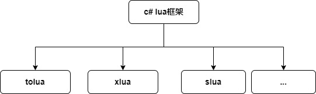
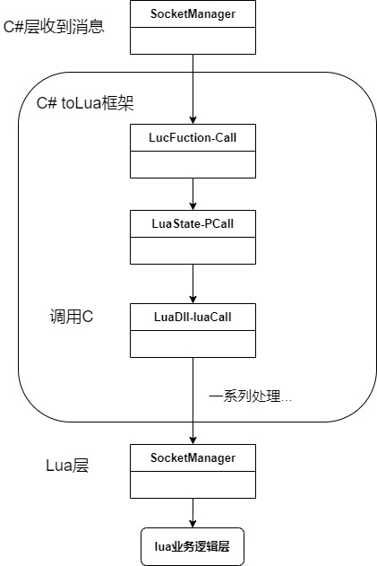
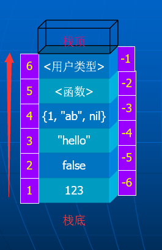

# lua和C#交互

## 目录

1. #### lua简介

2. #### 探讨背景

3. #### C#和lua交互

4. #### C#使用lua实现热更新技术优缺点

5. #### 总结


1. ## lua简介

   Lua是一种轻量级、高效的**脚本语言**，可以直接在运行时被解释执行，无需编译过程，广泛应用于嵌入式系统设备编程、脚本自动化与配置管理、redis等数据库使用lua脚本执行逻辑处理、**游戏开发**（**Unity C#使用lua**热更新、c/c++使用lua热更新等处理（Skynet游戏服务器框架、KBEngine等））等 

2. ## 探讨背景

   在Unity c#项目早期，当Lua热更新技术尚未普及时，开发者主要依赖**C#反射**实现热更新。然而，这种方案存在显著缺陷，且因**苹果**的严格审核政策被禁止。后续Lua热更新技术的出现有效解决了这些问题，成为主流方案

   ### **2.1早期反射技术实现热更新的缺陷**

   1. **性能问题**
      反射通过运行时动态解析类型和调用方法实现热更，但频繁的反射操作会导致**性能损耗**（尤其是iOS设备），影响游戏流畅度。
   2. **平台兼容性差**
      - **iOS的AOT编译限制**：iOS使用IL2CPP将C#代码编译为原生代码，**禁止动态生成代码**（如`System.Reflection.Emit`），导致反射加载新程序集（DLL）的功能失效。
      - **Android的JIT限制**：虽然Android支持JIT编译，但动态加载DLL可能导致内存泄漏或兼容性问题。
   3. **安全隐患**
      反射允许绕过类型安全检查，易引发代码注入漏洞，增加被恶意攻击的风险。
   4. **维护成本高**
      需手动管理程序集依赖和版本，代码耦合度高，热更逻辑复杂，后期维护困难。

   ------

   ### **2.2苹果禁止反射热更新的原因**

   苹果的**App Store审核指南**明确禁止应用下载或执行**可执行代码**（如DLL、脚本外的二进制文件）。反射技术动态加载C#程序集的行为被视为违反此政策，导致**应用被拒**。

   ------

   ### **2.3Lua热更新技术的解决方案**

   Lua作为轻量级脚本语言，通过以下方式规避了反射方案的缺陷：

   1. **绕过平台限制**
      - Lua代码以**文本资源形式**（如`.lua`文件）加载，无需编译为原生代码，符合苹果政策。
      - 通过**Lua虚拟机**解释执行，不依赖JIT或AOT编译，天然支持iOS平台。
   2. **性能与灵活性**
      - **热重载逻辑**：修改Lua脚本后无需重启游戏，实时生效。
      - **与C#高效交互**：借助中间层（如tolua、xlua）实现C#与Lua通信，平衡性能与开发效率。
   3. **低维护成本**
      - 逻辑与资源分离，通过AssetBundle管理资源热更，Lua管理代码热更，降低耦合度。
      - 脚本语言易调试和迭代，适合敏捷开发。
   4. **安全性提升**
      Lua脚本运行在沙盒环境中，通过虚拟机**隔离原生代码**，减少安全风险。

   ### 2.4 C#Lua框架

   

3. ## C#和lua交互

   **交互目的**

   1. C#调用lua；
   2. lua调用C#

   **LuaState**

   C#能调用lua的原理就是创建了一个**lua虚拟机**LuaState，LuaState封装了对lua 主要数据结构、 lua_State 指针的各种堆栈操作

   ### 3.1 C#调用lua流程图

   应用场景：在手游热更框架**C#层**socket数据处理流程中，当收到服务器消息时，需要将接收到数据交给**lua层**处理，处理流程如下：

   

   

   ### **3.2典型c#调用lua流程与栈变化**

   ```csharp
   // 1. 获取Lua函数
   LuaFunction addFunc = luaState.GetFunction("math.add"); 
   
   // 2. 参数压栈
   addFunc.BeginPCall();  // 栈状态: [函数] (核心调用LuaState-BeginCall)
   addFunc.Push(10);      // 栈状态: [函数, 10] (核心调用LuaState-Push)
   addFunc.Push(20);      // 栈状态: [函数, 10, 20]
   
   // 3. 执行PCall 会弹出函数和参数，执行后将返回值压入栈顶（约定, 确保跨语言调用的标准化）
   int status = addFunc.PCall(2, 1); // 消耗3栈位（函数+参数）
   
   // 4. 处理结果
   if (status == LuaException.LUA_OK) {
       int result = addFunc.CheckInteger(-1); // 从栈顶读取返回值
       addFunc.EndPCall(); // 清理返回值（栈恢复初始状态）
   }
   ```

   **栈操作隐藏步骤**‌：

   1. 压栈：将函数、参数入栈
   2. 调用：`pcall`执行函数
   3. 出栈：获取栈顶返回值并清理栈空间

   ### **3.3lua栈**

   

   ​	C#会告诉虚拟机传入的参数和需要返回的参数，然后虚拟机开始访问栈，从栈中取出对应函数传送给Lua编译器。然后lua程序调用Lua文件全局表（Global table）查找对应函数，然后将返回参数入栈，C#再从栈中读取数据

   ​	实际场景中，函数调用存在层级关系。当C#调用Lua函数A，A又回调C#函数B时、再或者递归调用时参数压栈/退栈就像套娃操作，栈结构能天然保存两层调用的参数环境

   **示例：假设存在Lua函数嵌套调用链：**

   ```lua
   function multiply(a, b) 
     	return a * b end
   function add_and_multiply(x, y, z) 
       return multiply(x + y, z)
   end
   ```

   当C#调用`add_and_multiply(2, 3, 4)`时，栈交互流程如下：

   ##### 阶段1：C#调用入口

   ```c#
   LuaFunction func = lua.GetFunction("add_and_multiply");
   ... //代码省略
   ```

   **栈布局**

   ```lua
   [func_ref, 2, 3, 4]  -- func_ref为函数引用，参数按从右向左压栈
   ```

   ##### 阶段2：Lua执行`add_and_multiply`

   1.**取出参数**‌：弹出`4,3,2`并计算`x+y=5`

   ‌2.**准备嵌套调用**‌：压入`multiply`函数引用和参数`5,4`
    ‌**新栈布局**‌

   ```lua
   [multiply_ref, 5, 4]
   ```

   ##### 阶段3：执行`multiply`

   1. 弹出`4,5`计算`5*4=20`
   2. 结果压栈：

   **栈布局**‌

   ```lua
   [20]  -- 返回值占据栈顶
   ```

   ##### 阶段4：结果返回C#

   1. C#从栈顶（索引-1）读取返回值`20`
   2. 清空栈完成调用链

   ### **3.4lua调用C#**

   1. 基于反射调用（不推荐）

      Lua通过C#的`System.Reflection`获取目标类的`Type`对象，再动态提取方法/属性信息

      ```
      -- Lua中调用C#类的静态方法
      local cls = CS.Namespace.ClassName  -- 获取Type对象
      local method = cls:GetMethod("MethodName")  -- 反射获取方法
      method:Invoke(nil, {arg1, arg2})  -- 参数以table形式传递
      ```

      **性能关键瓶颈**‌

      每次调用均需执行：

      1. 类型查找（`GetType`）
      2. 方法绑定（`GetMethod`）
      3. 参数装箱/拆箱
      4. 安全校验（权限/参数类型）
      5. Invoke反射调用

      实测数据：单次反射调用耗时约为Wrap包装类调用的‌**50-100倍**‌

   2. **非反射绑定（去反射机制）**‌

      - 预编译阶段为C#类生成Wrap包装类，生成对应的Wrap中间层代码，避免运行时反射开销
      - Wrap类通过`LuaDLL`注册到Lua虚拟机，建立类型映射

   3. **非反射绑定Lua调用C#流程**‌

      ```
      local obj = CS.UnityEngine.GameObject() -- 实例化对象
      obj.name = "LuaObj"                     -- 修改字段属性值
      ```

   4. **错误处理机制**‌

      - PCall返回非`LUA_OK`时自动捕获错误
      - 可通过`errfunc`参数指定Lua错误处理函数（需预先压栈）
      - 错误信息默认以字符串形式存放于栈顶

   5. **性能优化设计**

      - ‌高频调用优化
        - 使用`LuaFunction`缓存函数引用，避免重复查找
        - 委托转换（`ToDelegate`）减少栈操作次数
      - ‌内存安全
        - 调用结束后自动平衡栈状态（`lua.CheckTop()`）
        - 复杂对象通过引用计数管理生命周期

   6. ‌**关键设计优势**

      1. ‌高效跨语言调用
         - 通过预生成的Wrap类实现C#与Lua直接指针级交互
      2. ‌资源隔离性
         - Lua栈独立于C#托管堆，通过`LuaState`封装访问
      3. ‌热更新支持
         - Lua代码/数据可通过AssetBundle动态加载替换

      >  ‌**性能风险点**‌：频繁通过`gameobj.transform`等Unity API跨语言访问会引发栈操作风暴，需改用缓存策略

4. ##  C#使用lua实现技术优缺点

   ### 4.1 优点

   **跨平台热更能力**‌

   - iOS平台绕过JIT限制：Lua作为解释型语言无需编译，可直接更新逻辑代码，规避iOS对动态代码执行的限制
   - 资源+代码同步更新：支持脚本（Lua文件）与资源（AssetBundle）联动热更

   ‌**开发迭代敏捷性**‌

   - 无需重打包：修改Lua脚本后直接部署服务器，客户端动态加载
   - 框架生态成熟：xLua/ToLua等方案提供完善的C#↔Lua交互接口（如方法替换、事件绑定）

   ‌**安全与维护性**‌

   - 隔离核心代码：关键引擎逻辑保留在C#，业务逻辑下沉Lua，降低热更风险
   - 版本回滚简易：Lua脚本可快速替换为旧版，紧急修复线上问题

   ### 4.2 缺点

   **性能瓶颈**‌

   - 执行效率低：Lua解释执行耗时约为C#的‌**5-10倍**‌，高频调用（如每帧坐标更新）易成性能黑洞
   - 跨语言开销：C#调用Lua函数需经虚拟机中转，单次调用产生额外‌**2-5μs**‌延迟

   ‌**语言开发成本**‌

   - 双语言协作成本：团队需同时掌握C#和Lua，且需设计脚本框架（如luaMVC分层）

   ‌**技术限制**‌

   - GC压力：Lua虚拟机GC与Unity GC独立运行，需要分别处理内存管理，防止内存泄漏

5. ## 总结

   - c#使用lua：苹果禁止反射实现热更新，性能和安全问题；
   - c#调用lua：通过luaSate虚拟机调用c，c调用lua，调用过程涉及lua栈数据交互；
   - lua调用c#：预编译生成warp包装类，对比反射调用提高性能