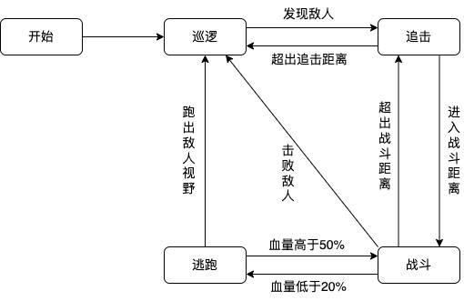
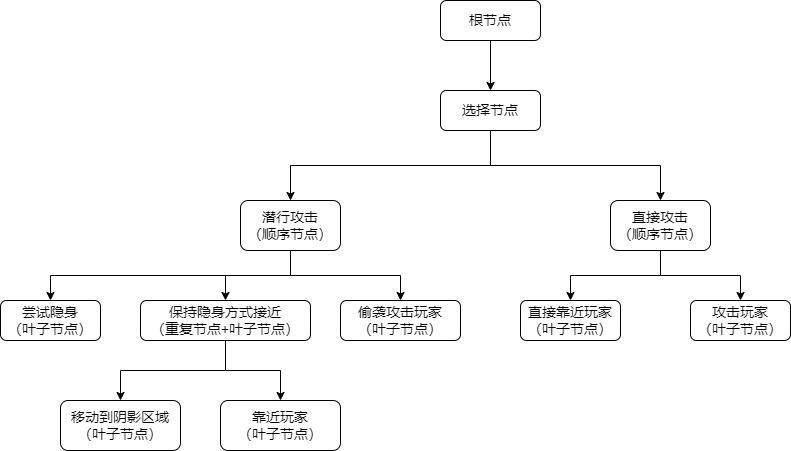
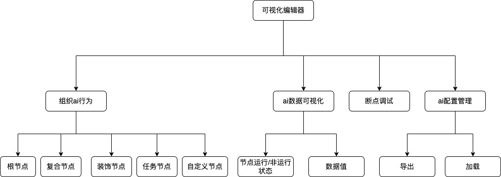
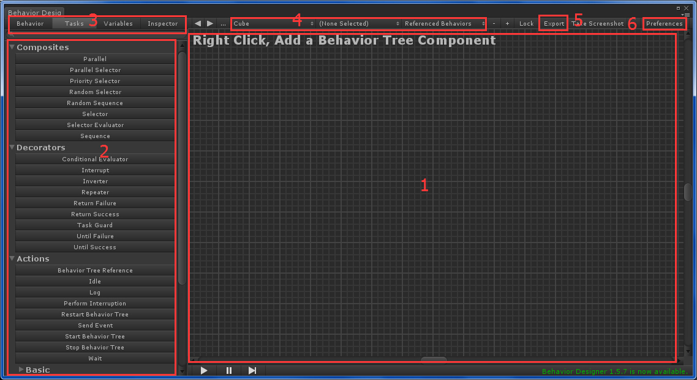
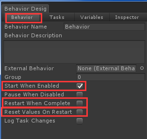
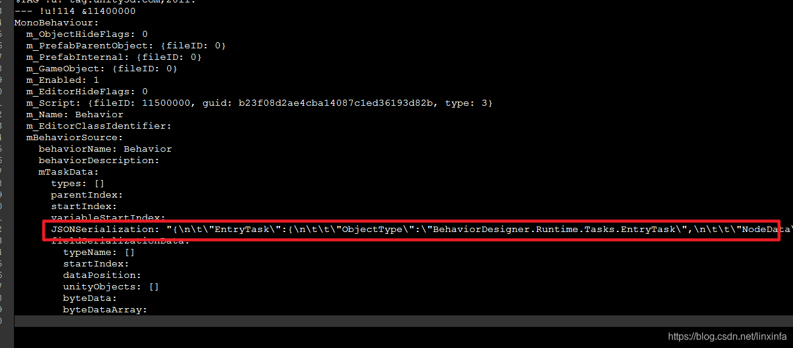
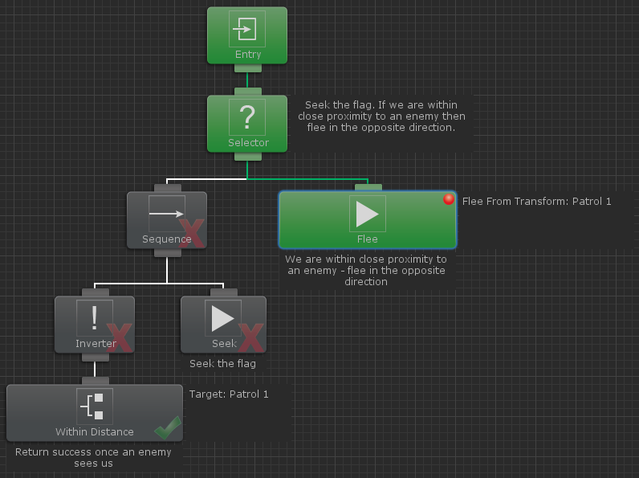
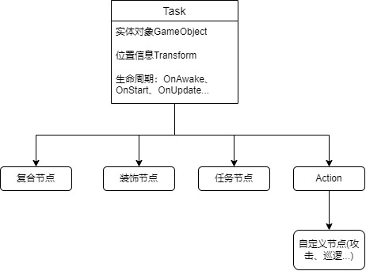
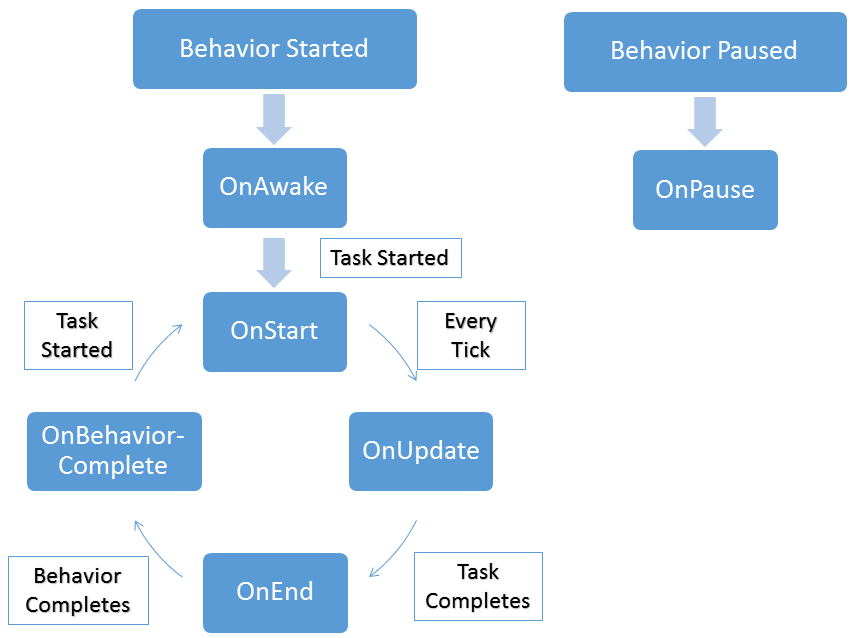
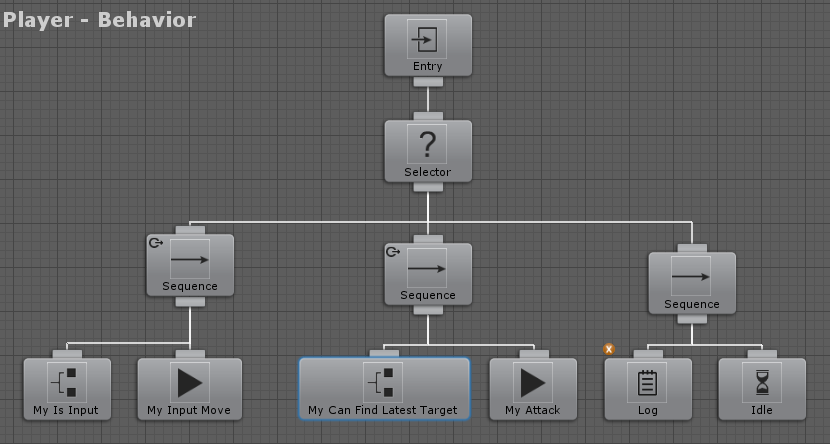

# 行为树BehaviorTree工作机制


## 目录

1. #### 行为树概述

2. #### 有限状态机（FSM）与行为树

3. #### 行为树框架构成

4. #### 一个简单的行为树示例

5. #### 总结

   

## **1. 行为树概述**

在游戏开发中，行为树（Behavior Tree, BT）是一种用于控制 NPC、AI 角色行为的结构化技术。相比传统的有限状态机（FSM），行为树具备模块化、扩展性、可视化、可读性、复用性、易调试性等优点，被广泛应用于物体AI、NPC 交互等

## 2 有限状态机（FSM）与行为树

### 2.1有限状态机（FSM）

**定义**：有限状态机，（Finite State Machine, FSM），是一种对事物运行规则进行抽象模型。它通过定义系统的状态、事件和转换规则，来描述系统在不同状态下的行为以及状态之间的转换。‌

**状态机的组成：**
**状态（State）‌**：描述物体在某一时刻所处的状态枚举。例如ARPG游戏中，角色有静止状态、移动状态等(AIState.IDLE、AIState.WALK...)。
**‌转换（Transition）‌：**从一个状态到另一个状态转换，当用户点击摇杆时，从静态状态切换到移动状态，用户点击摇杆位移值是转换条件。
**‌动作（Action）‌**：具体的行为动作逻辑，例如在行走动作中，该Action负责行走逻辑。

**驱动方式：**停留在某一状态执行逻辑，直到条件触发切换另一状态。

一个简单的怪物状态机示例：



**使用状态机的好处是：**

- ‌清晰的状态管理‌：明确定义所有可能状态及其转换规则。
- ‌简化复杂逻辑‌：将复杂的条件分支转换为直观的状态图。
- ‌易于维护和扩展‌：结构化的设计使得修改和扩展更加方便。


**局限性**

比如在上面的例子中，我们能很容易表示出怪物的行为逻辑。但如果我们要设计一个行为逻辑很复杂的怪物呢？如果怪物不止有以上四种状态，还有很多乱七八糟的状态，比如报警、潜行、偷袭、假死....等等，那这些状态之是不是需要考虑在每两个状态间都要考虑是否能够切换？

### 2.2行为树

**定义**：行为树是游戏中常用的AI技术，融合了多种不同的AI技术：分层状态机、调度、规划和动作执行。其主要优势之一是易于理解，并且可以使用可视化编辑器创建

**一个怪物使用行为树场景(部分ai)**：

行动方式：巡逻、隐身贴近、追击

攻击手段：潜行攻击、直接攻击

**驱动方式**：从根节点tick遍历，动态选择当前需执行的节点



## 3.行为树框架构成

可视化编辑器+行为树框架实现

#### 3.1可视化编辑器

**主要构成：**



**unity行为树编辑器示例**



- **1部分**：行为树的组织区域，组织物体有哪些行为

- **2部分**：Composities（复合节点）、Decorators（装饰节点）和Actions（行为节点），

- **3部分**：Behavior标签，可以设置行为树的一些属性




1. Start When Enabled：如果设置为 true，那么当这个行为树组件 enabled 的时候，这个行为树就会被执行
2. Restart When Complete选项，如果设置为 true，则行为树遍历完后会再重新启动一次，不断循环，一般情况下，也需要让行为树一直运行
3. Variables标签，可以给行为树添加变量，这些变量可以通过GetVariable跟SetVariableValue来读取和赋值，并可以在各种Task节点里进行传递和赋值。
4. Inspector标签是Task的检视窗口，我们可以在这个标签里设置Task的属性

**4部分**：这里是当前的行为树物体和对象，可以点击进行切换不同的行为树物体和行为树对象，一个物体可以绑定多个行为树

**5部分**：Export，就是把行为树导出成外部文件，可以选择二进制文件或者Json文件，导出的格式可以在6部分那里进行设置。导出后是一个xxxx.asset文件

json格式示例



**调试**

行为树运行时，会看到不同的任务在灰色和绿色之间变换颜色。绿色表示任务正在执行。灰色表示任务未在执行。任务执行完成后，右下角会显示一个勾号或 x。如果任务返回成功，则会显示勾号。如果返回失败，则会显示 x。任务执行期间，可以在检查器中更改值，更改后的值会反映在游戏中



#### 3.2行为树框架部分

行为树的核心是一个**树状层级结构**，每个节点都有不同的功能，最终决定 AI 的行为。
 行为树的节点可以分为以下几类：

- 根节点（Root）

- 复合节点（Composite Nodes）

- 装饰节点（Decorator Nodes）

- 自定义节点（Leaf Nodes）


**节点继承关系**

在行为树框架设计中，复合节点、装饰节点、自定义节点继承抽象类Task，由行为树BehaviorManager驱动



##### 行为树生命周期

物体建立的行为树结构由**行为树BehaviorManager**驱动，tick驱动物体行为树下的**逻辑节点**，调用生命周期如下：



## 

**1.根节点（Root Node）**

根节点是行为树的起点，它没有输入，只能有一个子节点。根节点的作用是执行**行为树的入口逻辑**。


**2.复合节点（Composite Nodes）**

复合节点是行为树的“分支结构”，用于管理子节点的执行逻辑。主要包括：

1. **顺序（Sequence）节点**

2. **选择（Selector）节点**

3. **并行（Parallel）节点**

4. **随机（Random）节点**

   

##### **顺序节点（Sequence Node）**

- **执行方式**：从左到右依次执行子节点，**如果所有子节点都成功，则返回成功**，一旦有子节点失败，则立即停止执行并返回失败。
- **应用场景**：用于**确保一系列任务按顺序执行**，比如“巡逻 -> 发现敌人 -> 追踪 -> 攻击”。


##### **选择节点（Selector Node）**

- **执行方式**：从左到右依次执行子节点，**一旦有一个子节点成功，则停止执行并返回成功**，如果所有子节点都失败，则返回失败。
- **应用场景**：用于**尝试多个可能的行为，直到找到一个成功的**，比如“寻找掩体 -> 逃跑 -> 乞求饶命”。


##### **并行节点（Parallel Node）**

- 执行方式：   
  - **强制模式**（所有子节点需成功，才返回成功）
  - **任意模式**（任意一个子节点成功就返回成功）
- **应用场景**：执行多个任务，比如在追踪过程中攻击（允许两种状态同时进行，攻击时不停止追踪）。


##### **随机节点（Random Node）**

- **执行方式**：随机选择一个子节点执行。
- **应用场景**：AI 角色有多种行为选择，如“巡逻、原地站立、绕圈”等，每次选择不同的行为。


**3.装饰节点（Decorator Nodes）**

装饰节点只有一个子节点，用于控制子节点的执行条件，例如：

- **反转（Inverter）**
- **重复（Repeat）**
- **条件检查（Condition）**
- **冷却时间（Cooldown）**

##### **① 反转节点（Inverter）**

- **执行方式**：如果子节点返回成功，则变为失败；如果失败，则变为成功。
- **应用场景**：适用于“如果没有敌人，执行某个行为”。

##### **② 重复节点（Repeat）**

- **执行方式**：不断重复执行子节点，直到达到指定次数或某个条件满足。
- **应用场景**：适用于循环行为，如**巡逻、检测敌人、射击等**。

##### **③ 条件检查（Condition Node）**

- **执行方式**：检查某个条件是否满足，满足时才继续执行子节点。
- **应用场景**：适用于**敌人生命值是否低于 50% 才撤退**。

##### **④ 冷却时间（Cooldown Node）**

- **执行方式**：当冷却时间未结束时，不执行子节点。
- **应用场景**：适用于“技能 CD 时间到达后才释放”。


**4. 自定义节点（叶子节点Leaf Nodes）**

任务节点是行为树的叶子节点，一般负责**执行具体的动作**，比如：

- **巡逻**
- **攻击**
- **躲避**

这些节点通常会调用游戏中的实际业务逻辑，例如：

```c#
public class AttackAction : Action
{
    public override NodeStatus Execute()
    {
        // 执行攻击逻辑
        AttackEnemy();
        return NodeStatus.Success;
    }
}
```

## 4.一个简单的行为树示例

**简单示例：**

移动：当玩家有输入时按照输入值来移动

尝试攻击：无输入时查找最近的可攻击目标，如果能找到就执行攻击

待机：当既没有输入也没有找到攻击目标时，那就一直处于待机状态。



## 总结

行为树是一种强大的 AI 控制方式，能够提供清晰、直观的行为管理方式。不同的控制节点、装饰节点、任务节点的组合，使 AI 能够做出复杂的决策，并提供良好的扩展性。

**驱动方式**：从根节点tick遍历，动态选择当前需执行的节点

**通用性：**抽象Task；提供逻辑节点组合（组合模式），可以将复杂模块通用局部组合模式实现

**良好可调试性：**实时观察节点运行状态、节点数据；
